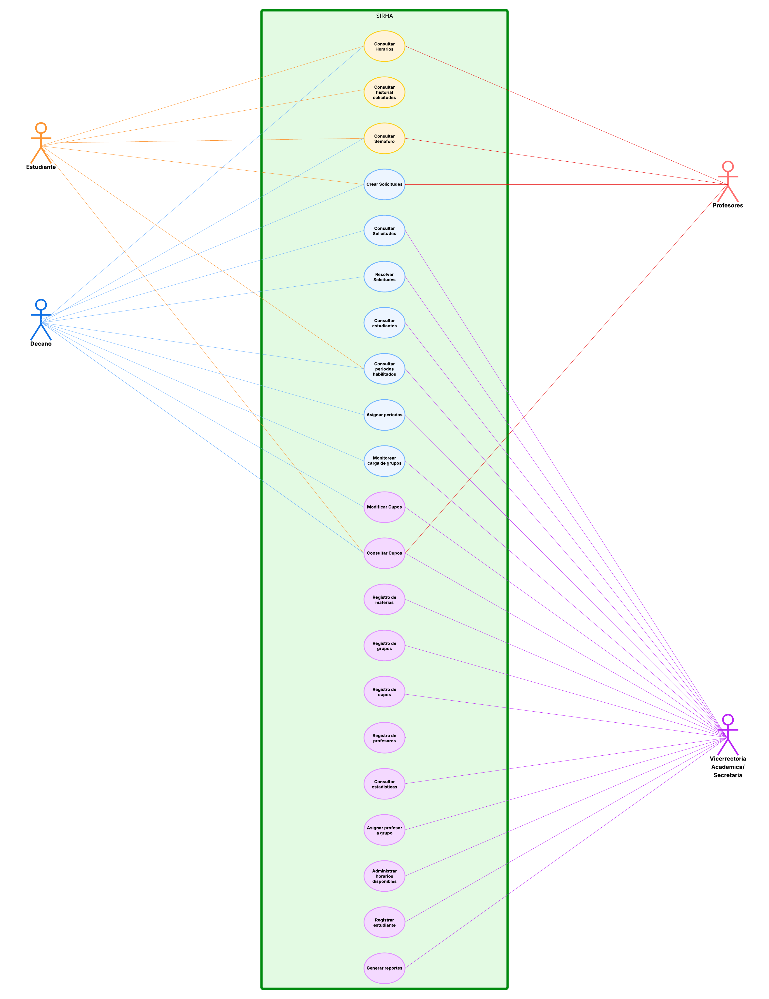
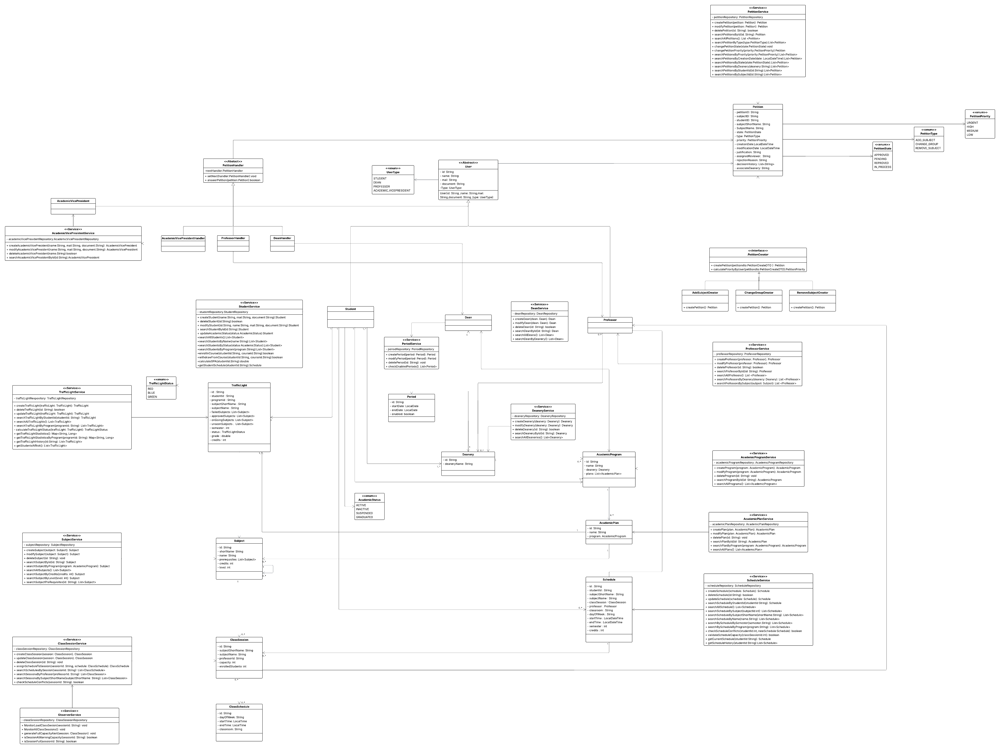
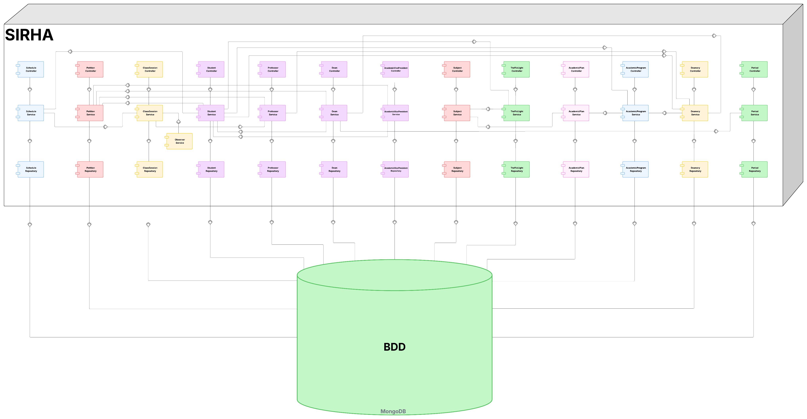
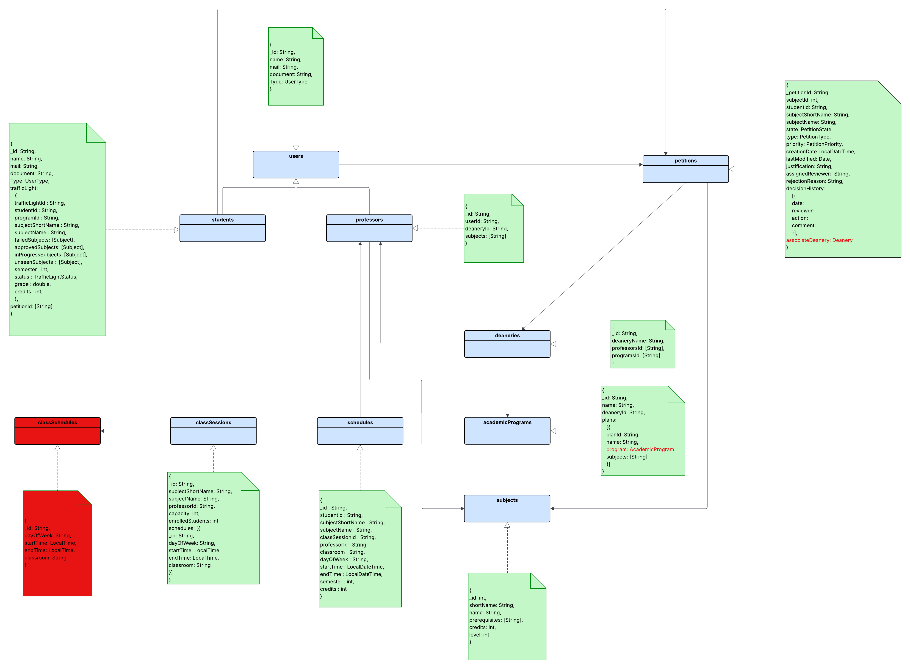
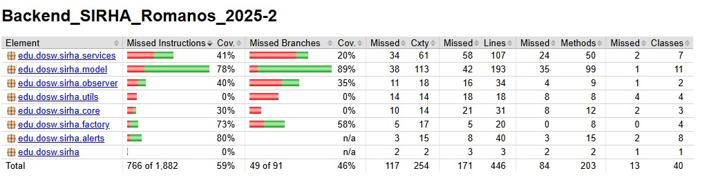

# Backend_SIRHA_Romanos_2025-2

En este repositorio se manejara todo el Backend del proyecto inicial "SIRHA" para la materia DOSW.

---

### 👤Integrantes:
- Elizabeth Correa
- Sebastian Ortega
- Belén Quintero
- Nikolas Martinez
- Juan Pablo Contreras

## 🎯 Objetivo del Proyecto
El proyecto **SIRHA (Sistema de Reasignación de Horarios Académicos)** tiene como objetivo gestionar y optimizar las solicitudes de cambio de materia y grupo dentro de la Escuela Colombiana de Ingeniería, ofreciendo trazabilidad, priorización automática y control de capacidad.  
Busca brindar a estudiantes, profesores y decanaturas una herramienta digital para realizar, evaluar y aprobar solicitudes académicas de forma organizada y eficiente, aplicando buenas prácticas de ingeniería de software y metodologías ágiles.

---

## ⚡ Funcionalidades principales

### 🔹 Gestión de Estudiantes
- Registro y autenticación con credenciales institucionales.  
- Consulta de horario actual y semestres anteriores.  
- Visualización del **semáforo académico** (verde = normal, azul = en progreso, rojo = perdida).  
- Creación de solicitudes de cambio de materia/grupo.  
- Consulta del estado de solicitudes (pendiente, en revisión, aprobada, rechazada).  
- Historial de solicitudes realizadas.  

### 🔹 Gestión de Decanatura
- Acceso restringido por facultad.  
- Bandeja de solicitudes recibidas en su área.  
- Visualización del horario del estudiante solicitante.  
- Consulta de semáforo académico del estudiante.  
- Ver disponibilidad de grupos alternos (capacidad, cupo máximo, lista de espera).  
- Responder solicitudes (aprobar, rechazar, pedir información adicional).  
- Configuración de periodos habilitados para cambios.  
- Monitoreo de cargas de grupos (alerta al 90% de capacidad).  

### 🔹 Gestión de Materias y Grupos
- Registro de materias, grupos y cupos.  
- Consulta de capacidad de cada grupo (inscritos vs cupo máximo).  
- Registro de profesores asignados.  
- Administración de horarios disponibles.  

### 🔹 Gestión de Solicitudes
- Recepción y ruteo automático de solicitudes según facultad.  
- Asignación de prioridad automática (orden de llegada).  
- Registro de todas las decisiones (trazabilidad).  
- Reportes de solicitudes pendientes, aprobadas y rechazadas.  

### 🔹 Reportes y Estadísticas
- Historial de cambios por estudiante.  
- Estadísticas de grupos más solicitados.  
- Tasa de aprobación vs rechazo.  
- Indicadores globales de avance en los planes de estudio (semaforización).  

---

## ⚙️ Tecnologías a utilizar
- Java JDK Runtime Environment: 17.x.x
- Spring Boot 3.x
- Apache Maven: 3.9.x
- JUnit 5
- Jacoco
- SonarQube
- Docker
- Swagger
- [Otras tecnologías relevantes]

---
# Manejo de Estrategia de versionamiento y branches

## Estrategia de Ramas (Git Flow)


## Ramas y propósito
- Manejaremos GitFlow, el modelo de ramificación para el control de versiones de Git

### `main`
- **Propósito:** rama **estable** con la versión final (lista para demo/producción).
- **Reglas:**
    - Solo recibe merges desde `release/*` y `hotfix/*`.
    - Cada merge a `main` debe crear un **tag** SemVer (`vX.Y.Z`).
    - Rama **protegida**: PR obligatorio, 1–2 aprobaciones, checks de CI en verde.

### `develop`
- **Propósito:** integración continua de trabajo; base de nuevas funcionalidades.
- **Reglas:**
    - Recibe merges desde `feature/*` y también desde `release/*` al finalizar un release.
    - Rama **protegida** similar a `main`.

### `feature/*`
- **Propósito:** desarrollo de una funcionalidad, refactor o spike.
- **Base:** `develop`.
- **Cierre:** se fusiona a `develop` mediante **PR**


### `release/*`
- **Propósito:** congelar cambios para estabilizar pruebas, textos y versiones previas al deploy.
- **Base:** `develop`.
- **Cierre:** merge a `main` (crear **tag** `vX.Y.Z`) **y** merge de vuelta a `develop`.
- **Ejemplo de nombre:**  
  `release/1.3.0`

### `hotfix/*`
- **Propósito:** corregir un bug **crítico** detectado en `main`.
- **Base:** `main`.
- **Cierre:** merge a `main` (crear **tag** de **PATCH**) **y** merge a `develop` para mantener paridad.
- **Ejemplos de nombre:**  
  `hotfix/fix-blank-screen`, `hotfix/css-broken-header`


---

## Convenciones para **crear ramas**

### `feature/*`
**Formato:**
```
feature/[nombre-funcionalidad]-sirha_[codigo-jira]
```

**Ejemplos:**
- `feature/readme_sirha-34`

**Reglas de nomenclatura:**
- Usar **kebab-case** (palabras separadas por guiones)
- Máximo 50 caracteres en total
- Descripción clara y específica de la funcionalidad
- Código de Jira obligatorio para trazabilidad

### `release/*`
**Formato:**
```
release/[version]
```
**Ejemplo:** `release/1.3.0`

### `hotfix/*`
**Formato:**
```
hotfix/[descripcion-breve-del-fix]
```
**Ejemplos:**
- `hotfix/corregir-pantalla-blanca`
- `hotfix/arreglar-header-responsive`

---

## Convenciones para **crear commits**

### **Formato:**
```
[codigo-jira] [tipo]: [descripción específica de la acción]
```

### **Tipos de commit:**
- `feat`: Nueva funcionalidad
- `fix`: Corrección de errores
- `docs`: Cambios en documentación
- `style`: Cambios de formato/estilo (espacios, punto y coma, etc.)
- `refactor`: Refactorización de código sin cambios funcionales
- `test`: Agregar o modificar tests
- `chore`: Tareas de mantenimiento, configuración, dependencias

### **Ejemplos de commits específicos:**
```bash
# ✅ BUENOS EJEMPLOS
git commit -m "26-feat: agregar validación de email en formulario login"
git commit -m "24-fix: corregir error de navegación en header mobile"


# ❌ EVITAR 
git commit -m "23-feat: agregar login"
git commit -m "24-fix: arreglar bug"

```

### **Reglas para commits específicos:**
1. **Un commit = Una acción específica**: Cada commit debe representar un cambio lógico y completo
2. **Máximo 72 caracteres**: Para que sea legible en todas las herramientas Git
3. **Usar imperativo**: "agregar", "corregir", "actualizar" (no "agregado", "corrigiendo")
4. **Ser descriptivo**: Especificar QUÉ se cambió y DÓNDE
5. **Commits frecuentes**: Mejor muchos commits pequeños que pocos grandes

### **Beneficios de commits específicos:**
- 🔄 **Rollback preciso**: Poder revertir solo la parte problemática
- 🔍 **Debugging eficiente**: Identificar rápidamente cuándo se introdujo un bug
- 📖 **Historial legible**: Entender la evolución del código
- 🤝 **Colaboración mejorada**: Reviews más fáciles y claras


---


## 🏗️ Arquitectura Backend (MVC)

El backend sigue la **arquitectura Modelo–Vista–Controlador (MVC)**. La estructura de carpetas se organizó para mantener separación de responsabilidades y buenas prácticas de ingeniería:


```
📁 src/main/java/edu/dosw/taller/
│
├── 📁 configs/               # ⚙️ Configuraciones globales (Swagger, seguridad, etc.)
├── 📁 controller/            # 🌐 Controladores REST (exposición de endpoints)
├── 📁 model/                 # 📊 Módulo de modelos y lógica base
│   ├── 📁 components/        # 🧩 Componentes adicionales (clases auxiliares)
│   │   └── 📁 util/          # 🛠️ Utilidades comunes
│   ├── 📁 entities/          # 📝 Entidades de dominio
│   ├── 📁 persistence/       # 🗄️ Persistencia y acceso a datos
│   │   └── 📁 repository/    # 🔗 Interfaces con la BD (MongoDB Repositories)
│   └── 📁 services/          # 🔧 Servicios dentro de la capa de modelo
└── 📄 Application.java       # 🚀 Clase principal Spring Boot


```

### 📋 Descripción de capas:

| **Capa**                      | **Responsabilidad**                                        | **Tecnologías / Anotaciones** |
|-------------------------------|------------------------------------------------------------|--------------------------------|
| **Controller**                | Manejo de peticiones HTTP y exposición de endpoints REST.  | Spring MVC, `@RestController` |
| **Model**                     | Contiene el modelo de dominio y submódulos relacionados.   | Java classes, Lombok, DTOs |
| ├─ **Entities**               | Definición de entidades principales (Task, User, etc.).    | `@Document`, `@Entity` |
| ├─ **Components/Utils**       | Clases auxiliares/componentes dentro del dominio.          | Beans, helpers de dominio |
| ├─ **Persistence/Repository** | Interfaces de acceso a datos y consultas CRUD. | MongoDB, Spring Data |
| └─ **Services**               | Servicios asociados al modelo (lógica de negocio puntual). | `@Service` |
| **Configs**                   | Configuración global de la aplicación.                     | Swagger, Security, CORS |
---


## 📊 Diagramas del sistema

Para la documentación y análisis del proyecto se generaron los siguientes diagramas UML:

- **Diagrama de Contexto**  
  

- **Diagrama de Casos de Uso**  
  

- **Diagrama de Clases** 
    
  https://lucid.app/lucidchart/85abc96b-6dc9-425f-99f8-2e3076d53ab4/edit?viewport_loc=-5114%2C-3188%2C9738%2C4070%2CnWZN8rpCuUsd&invitationId=inv_50cbed5a-0579-4f02-905c-2f4d0018f68d


- **Diagrama de Componentes (General)**  
  

- **Diagrama de Componentes (Específico)**  
  

- **Diagramas de Secuencia**  
  

- **Diagrama de Base de Datos (MongoDB)**  
  


---

## ✅ Evidencias de calidad

### Cobertura de código – JaCoCo
Reporte inicial de cobertura alcanzado en las pruebas unitarias del backend:  



Actualización de la cobertura alcanzada:


### Análisis estático – SonarQube
Resultados del análisis de calidad de código con SonarQube:  


---


