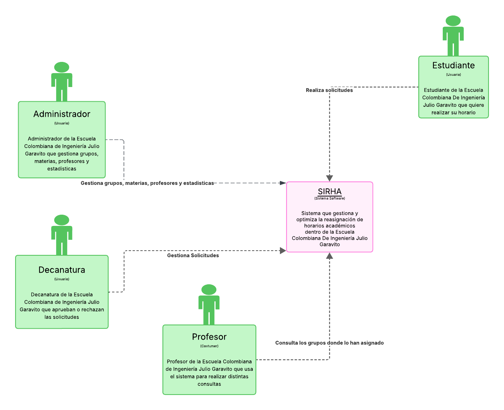
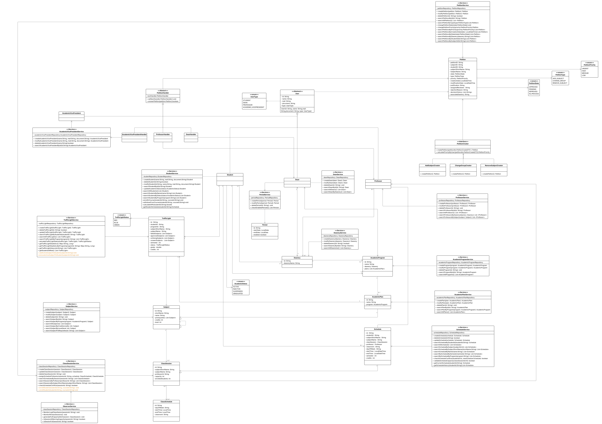
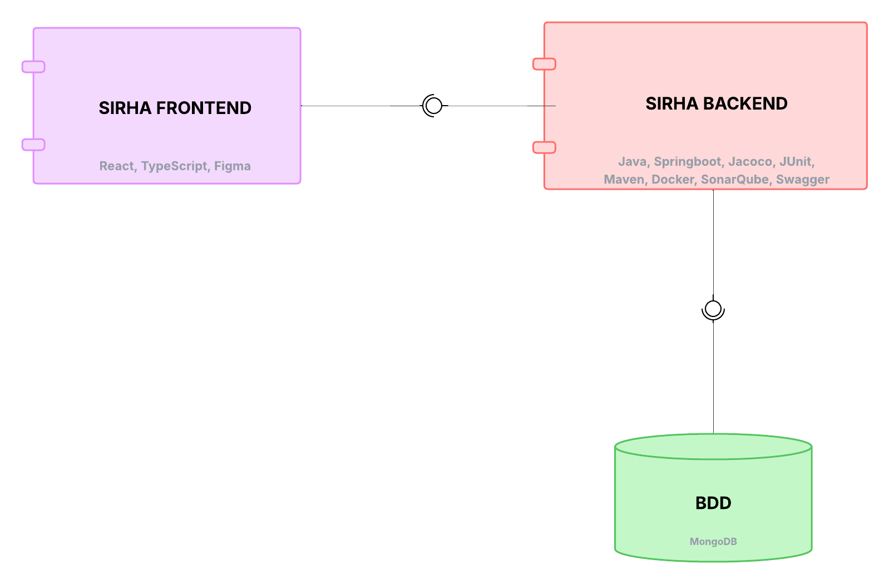
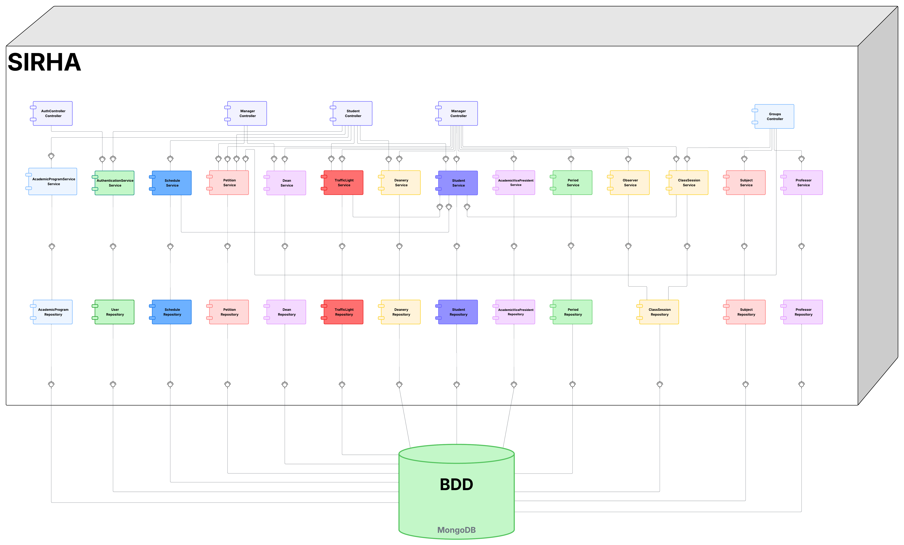
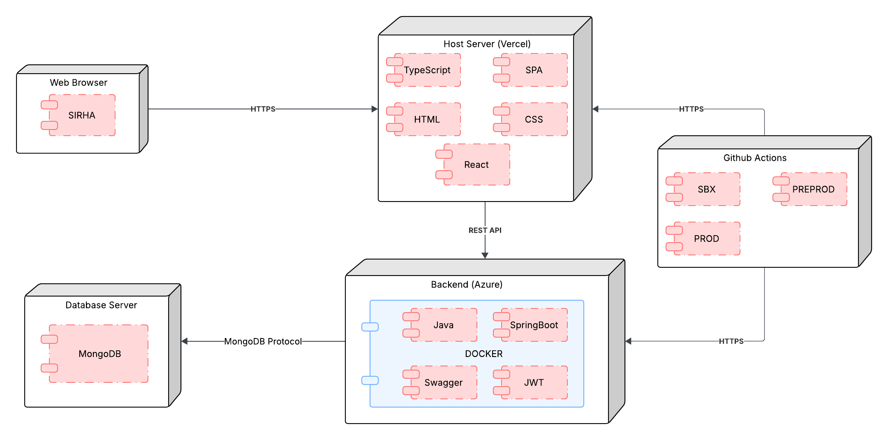
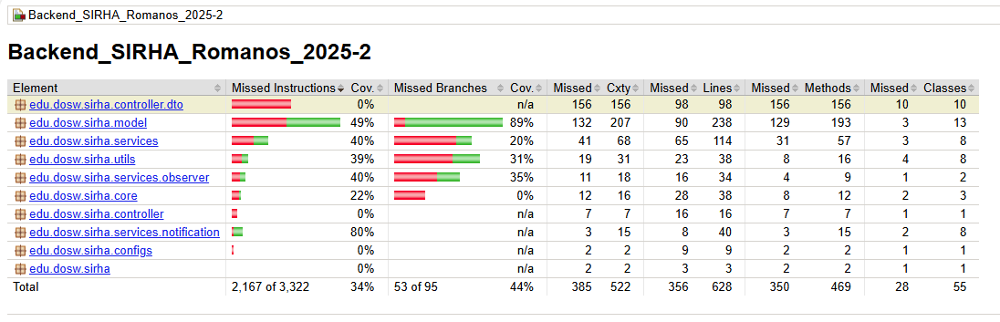
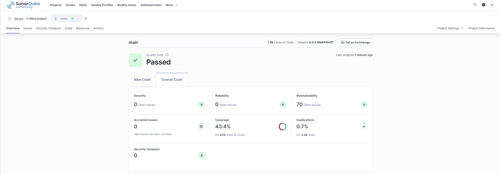
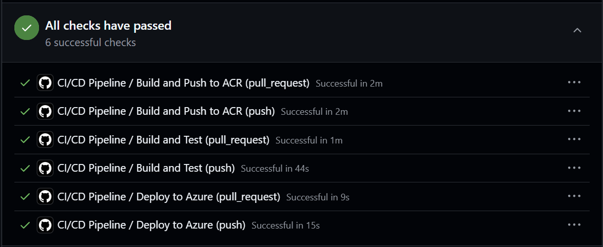

# 📚 SIRHA — Sistema de Reasignación de Horarios Académicos

> <b>Optimización y trazabilidad de solicitudes académicas en la Escuela Colombiana de Ingeniería Julio Garavito</b>

---

## 📑 Tabla de Contenidos

1. 👤 [Integrantes](#1-👤-integrantes)
2. 🎯 [Objetivo del Proyecto](#2-🎯-objetivo-del-proyecto)
3. ⚡ [Funcionalidades principales](#3-⚡-funcionalidades-principales)
4. 📋 [Manejo de Estrategia de versionamiento y branches](#4-📋-manejo-de-estrategia-de-versionamiento-y-branches)
   - 4.1 [Convenciones para crear ramas](#41-convenciones-para-crear-ramas)
   - 4.2 [Convenciones para crear commits](#42-convenciones-para-crear-commits)
5. ⚙️ [Tecnologías utilizadas](#5-⚙️-tecnologías-utilizadas)
6. 🧩 [Funcionalidad](#6-🧩-funcionalidad)
7. 📊 [Diagramas](#7-�-diagramas)
   - 7.1 🟩 [Diagrama de Contexto](#71-🟩-diagrama-de-contexto)
   - 7.2 🟦 [Diagrama de Casos de Uso](#72-🟦-diagrama-de-casos-de-uso)
   - 7.3 🟨 [Diagrama de Clases](#73-🟨-diagrama-de-clases)
   - 7.4 🟥 [Diagrama de Componentes — General](#74-🟥-diagrama-de-componentes--general)
   - 7.5 🟨 [Diagrama de Componentes — Específico (Backend)](#75-🟨-diagrama-de-componentes--específico-backend)
   - 7.6 🟩 [Diagrama de Base de Datos (MongoDB)](#76-🟩-diagrama-de-base-de-datos-mongodb)
   - 7.7 🛰️ [Diagrama de Despliegue](#77-🛰️-diagrama-de-despliegue)
8. 🌐 [Endpoints expuestos y su información de entrada y salida](#8-🌐-endpoints-expuestos-y-su-información-de-entrada-y-salida)
9. ⚠️ [Manejo de Errores](#9-⚠️-manejo-de-errores)
10. 🧪 [Evidencia de las pruebas y cómo ejecutarlas](#10-🧪-evidencia-de-las-pruebas-y-cómo-ejecutarlas)
11. 🗂️ [Código de la implementación organizado en las respectivas carpetas](#11-🗂️-código-de-la-implementación-organizado-en-las-respectivas-carpetas)
12. 📝 [Código documentado](#12-📝-código-documentado)
13. 🧾 [Pruebas coherentes con el porcentaje de cobertura expuesto](#13-🧾-pruebas-coherentes-con-el-porcentaje-de-cobertura-expuesto)
14. 🚀 [Ejecución del Proyecto](#14-🚀-ejecución-del-proyecto)
15. ☁️ [Evidencia de CI/CD y Despliegue en Azure](#15-☁️-evidencia-de-cicd-y-despliegue-en-azure)
16. 🤝 [Contribuciones y agradecimientos](#16-🤝-contribuciones-y-agradecimientos)


---

## 1. 👤 Integrantes:
- Elizabeth Correa
- Sebastian Ortega
- Belén Quintero
- Nikolas Martinez
- Juan Pablo Contreras

## 2. 🎯 Objetivo del Proyecto
El proyecto **SIRHA (Sistema de Reasignación de Horarios Académicos)** tiene como objetivo gestionar y optimizar las solicitudes de cambio de materia y grupo dentro de la Escuela Colombiana de Ingeniería, ofreciendo trazabilidad, priorización automática y control de capacidad.  
Busca brindar a estudiantes, profesores y decanaturas una herramienta digital para realizar, evaluar y aprobar solicitudes académicas de forma organizada y eficiente, aplicando buenas prácticas de ingeniería de software y metodologías ágiles.

---

## 3. ⚡ Funcionalidades principales

### 🔹 Gestión de Estudiantes
- Registro y autenticación con credenciales institucionales.  
- Consulta de horario actual y semestres anteriores.  
- Visualización del **semáforo académico** (verde = normal, azul = en progreso, rojo = perdida).  
- Creación de solicitudes de cambio de materia/grupo.  
- Consulta del estado de solicitudes (pendiente, en revisión, aprobada, rechazada).  
- Historial de solicitudes realizadas.  

### 🔹 Gestión de Decanatura
- Acceso restringido por facultad.  
- Bandeja de solicitudes recibidas en su área.  
- Visualización del horario del estudiante solicitante.  
- Consulta de semáforo académico del estudiante.  
- Ver disponibilidad de grupos alternos (capacidad, cupo máximo, lista de espera).  
- Responder solicitudes (aprobar, rechazar, pedir información adicional).  
- Configuración de periodos habilitados para cambios.  
- Monitoreo de cargas de grupos (alerta al 90% de capacidad).  

### 🔹 Gestión de Materias y Grupos
- Registro de materias, grupos y cupos.  
- Consulta de capacidad de cada grupo (inscritos vs cupo máximo).  
- Registro de profesores asignados.  
- Administración de horarios disponibles.  

### 🔹 Gestión de Solicitudes
- Recepción y ruteo automático de solicitudes según facultad.  
- Asignación de prioridad automática (orden de llegada).  
- Registro de todas las decisiones (trazabilidad).  
- Reportes de solicitudes pendientes, aprobadas y rechazadas.  

### 🔹 Reportes y Estadísticas
- Historial de cambios por estudiante.  
- Estadísticas de grupos más solicitados.  
- Tasa de aprobación vs rechazo.  
- Indicadores globales de avance en los planes de estudio (semaforización).  

---
## 4. 📋 Manejo de Estrategia de versionamiento y branches

### Estrategia de Ramas (Git Flow)


### Ramas y propósito
- Manejaremos GitFlow, el modelo de ramificación para el control de versiones de Git

#### `main`
- **Propósito:** rama **estable** con la versión final (lista para demo/producción).
- **Reglas:**
    - Solo recibe merges desde `release/*` y `hotfix/*`.
    - Cada merge a `main` debe crear un **tag** SemVer (`vX.Y.Z`).
    - Rama **protegida**: PR obligatorio, 1–2 aprobaciones, checks de CI en verde.

#### `develop`
- **Propósito:** integración continua de trabajo; base de nuevas funcionalidades.
- **Reglas:**
    - Recibe merges desde `feature/*` y también desde `release/*` al finalizar un release.
    - Rama **protegida** similar a `main`.

#### `feature/*`
- **Propósito:** desarrollo de una funcionalidad, refactor o spike.
- **Base:** `develop`.
- **Cierre:** se fusiona a `develop` mediante **PR**


#### `release/*`
- **Propósito:** congelar cambios para estabilizar pruebas, textos y versiones previas al deploy.
- **Base:** `develop`.
- **Cierre:** merge a `main` (crear **tag** `vX.Y.Z`) **y** merge de vuelta a `develop`.
- **Ejemplo de nombre:**  
  `release/1.3.0`

#### `hotfix/*`
- **Propósito:** corregir un bug **crítico** detectado en `main`.
- **Base:** `main`.
- **Cierre:** merge a `main` (crear **tag** de **PATCH**) **y** merge a `develop` para mantener paridad.
- **Ejemplos de nombre:**  
  `hotfix/fix-blank-screen`, `hotfix/css-broken-header`


---

### 4.1 Convenciones para **crear ramas**

#### `feature/*`
**Formato:**
```
feature/[nombre-funcionalidad]-sirha_[codigo-jira]
```

**Ejemplos:**
- `feature/readme_sirha-34`

**Reglas de nomenclatura:**
- Usar **kebab-case** (palabras separadas por guiones)
- Máximo 50 caracteres en total
- Descripción clara y específica de la funcionalidad
- Código de Jira obligatorio para trazabilidad

#### `release/*`
**Formato:**
```
release/[version]
```
**Ejemplo:** `release/1.3.0`

#### `hotfix/*`
**Formato:**
```
hotfix/[descripcion-breve-del-fix]
```
**Ejemplos:**
- `hotfix/corregir-pantalla-blanca`
- `hotfix/arreglar-header-responsive`

---

### 4.2 Convenciones para **crear commits**

#### **Formato:**
```
[codigo-jira] [tipo]: [descripción específica de la acción]
```

#### **Tipos de commit:**
- `feat`: Nueva funcionalidad
- `fix`: Corrección de errores
- `docs`: Cambios en documentación
- `style`: Cambios de formato/estilo (espacios, punto y coma, etc.)
- `refactor`: Refactorización de código sin cambios funcionales
- `test`: Agregar o modificar tests
- `chore`: Tareas de mantenimiento, configuración, dependencias

#### **Ejemplos de commits específicos:**
```bash
# ✅ BUENOS EJEMPLOS
git commit -m "26-feat: agregar validación de email en formulario login"
git commit -m "24-fix: corregir error de navegación en header mobile"


# ❌ EVITAR 
git commit -m "23-feat: agregar login"
git commit -m "24-fix: arreglar bug"

```

#### **Reglas para commits específicos:**
1. **Un commit = Una acción específica**: Cada commit debe representar un cambio lógico y completo
2. **Máximo 72 caracteres**: Para que sea legible en todas las herramientas Git
3. **Usar imperativo**: "agregar", "corregir", "actualizar" (no "agregado", "corrigiendo")
4. **Ser descriptivo**: Especificar QUÉ se cambió y DÓNDE
5. **Commits frecuentes**: Mejor muchos commits pequeños que pocos grandes

#### **Beneficios de commits específicos:**
- 🔄 **Rollback preciso**: Poder revertir solo la parte problemática
- 🔍 **Debugging eficiente**: Identificar rápidamente cuándo se introdujo un bug
- 📖 **Historial legible**: Entender la evolución del código
- 🤝 **Colaboración mejorada**: Reviews más fáciles y claras


---


## 5. ⚙️ Tecnologías utilizadas

El backend del sistema **SIRHA (Sistema de Reasignación de Horarios Académicos)** fue desarrollado con una arquitectura basada en **Spring Boot** y componentes del ecosistema **Java**, garantizando modularidad, mantenibilidad, seguridad y facilidad de despliegue.  
A continuación se detallan las principales tecnologías empleadas en el proyecto:

| **Tecnología / Herramienta** | **Versión / Framework** | **Uso principal en el proyecto** |
|------------------------------|--------------------------|----------------------------------|
| **Java OpenJDK** | 17 | Lenguaje de programación base del backend, orientado a objetos y multiplataforma. |
| **Spring Boot** | 3.x | Framework principal para la creación del API REST, manejo de dependencias e inyección de componentes. |
| **Spring Web** | — | Implementación del modelo MVC y exposición de endpoints REST. |
| **Spring Security** | — | Configuración de autenticación y autorización de usuarios mediante roles y validación de credenciales. |
| **Spring Data MongoDB** | — | Integración con la base de datos NoSQL MongoDB mediante el patrón Repository. |
| **MongoDB Atlas** | 6.x | Base de datos NoSQL en la nube utilizada para almacenar las entidades del sistema. |
| **Apache Maven** | 3.9.x | Gestión de dependencias, empaquetado del proyecto y automatización de builds. |
| **Lombok** | — | Reducción de código repetitivo con anotaciones como `@Getter`, `@Setter`, `@Builder` y `@AllArgsConstructor`. |
| **JUnit 5** | — | Framework para pruebas unitarias que garantiza el correcto funcionamiento de los servicios. |
| **Mockito** | — | Simulación de dependencias para pruebas unitarias sin requerir acceso a la base de datos real. |
| **JaCoCo** | — | Generación de reportes de cobertura de código para evaluar la efectividad de las pruebas. |
| **SonarQube** | — | Análisis estático del código fuente y control de calidad para detectar vulnerabilidades y malas prácticas. |
| **Swagger (OpenAPI 3)** | — | Generación automática de documentación y prueba interactiva de los endpoints REST. |
| **Postman** | — | Entorno de pruebas de la API, utilizado para validar respuestas en formato JSON con los métodos `POST`, `GET`, `PATCH` y `DELETE`. |
| **Docker** | — | Contenerización del servicio para garantizar despliegues consistentes en distintos entornos. |
| **Azure App Service** | — | Entorno de ejecución en la nube para el despliegue automático del backend. |
| **Azure DevOps** | — | Plataforma para la gestión ágil del proyecto, seguimiento de tareas y control de versiones. |
| **GitHub Actions** | — | Configuración de pipelines de integración y despliegue continuo (CI/CD). |
| **SSL / HTTPS** | — | Implementación de certificados digitales para asegurar la comunicación entre cliente y servidor. |

> 🧠 Estas tecnologías fueron seleccionadas para asegurar **escalabilidad**, **modularidad**, **seguridad**, **trazabilidad** y **mantenibilidad** del sistema, aplicando buenas prácticas de ingeniería de software y estándares de desarrollo moderno.


## 6. 🧩 Funcionalidad

### i. Descripción de cada funcionalidad y patrones utilizados

El backend de **SIRHA (Sistema de Reasignación de Horarios Académicos)** implementa una arquitectura basada en **MVC (Modelo–Vista–Controlador)** y los principios de **Clean Architecture**, garantizando separación de responsabilidades y mantenibilidad.  
A continuación se describen las principales funcionalidades y los patrones de diseño aplicados en cada módulo:

---

### 🔹 Gestión de Estudiantes
**Descripción:**  
Permite el registro, autenticación y gestión de la información académica del estudiante.  
Los estudiantes pueden consultar su horario actual, su historial académico y crear solicitudes de cambio de materia o grupo.

**Patrones utilizados:**
- **Controller Pattern:** los controladores (`StudentController`) gestionan las peticiones REST y comunican los servicios.  
- **Service Layer:** la lógica de negocio (validaciones, consultas, creación de solicitudes) se encuentra en `StudentService`.  
- **Repository Pattern:** los datos del estudiante se obtienen y persisten mediante `StudentRepository`.  
- **DTO (Data Transfer Object):** se usan DTOs para separar la estructura interna de las entidades de la información expuesta al cliente.  
- **Builder Pattern (Lombok):** simplifica la creación de objetos complejos como solicitudes o usuarios mediante `@Builder`.

---

### 🔹 Gestión de Decanatura
**Descripción:**  
Módulo destinado al personal de decanatura, encargado de revisar y responder las solicitudes enviadas por los estudiantes.  
Permite visualizar información académica del estudiante, revisar cupos de grupos y aprobar o rechazar solicitudes.

**Patrones utilizados:**
- **Controller Pattern:** `DeaneryController` expone los endpoints de revisión y aprobación de solicitudes.  
- **Service Layer:** `DeaneryService` implementa la lógica de validación de cupos, trazabilidad y cambios de estado.  
- **Repository Pattern:** integración con las colecciones de grupos y solicitudes en MongoDB.  
- **Strategy Pattern:** manejo de distintas acciones posibles sobre una solicitud (aprobar, rechazar, pedir información adicional).  
- **Observer Pattern (implícito):** notificaciones automáticas al estudiante cuando su solicitud cambia de estado.

---

### 🔹 Gestión de Materias y Grupos
**Descripción:**  
Administra las materias, sus grupos, horarios, profesores y capacidad máxima.  
Permite registrar nuevas materias, modificar cupos y consultar disponibilidad para las solicitudes.

**Patrones utilizados:**
- **Controller Pattern:** `SubjectController` y `GroupsController` exponen endpoints REST para la administración de materias y grupos.  
- **Repository Pattern:** `SubjectRepository` y `GroupRepository` manejan la persistencia en MongoDB.  
- **Service Layer:** `SubjectService` encapsula la lógica de registro y búsqueda de materias.  
- **Singleton Pattern (en configuración):** asegura una instancia única para servicios globales como la conexión a MongoDB.  

---

### 🔹 Gestión de Solicitudes
**Descripción:**  
Centraliza el proceso de envío, evaluación y registro de solicitudes académicas.  
Cada solicitud pasa por diferentes estados (pendiente, en revisión, aprobada, rechazada), garantizando trazabilidad y priorización automática.

**Patrones utilizados:**
- **Controller Pattern:** `PetitionsController` recibe y procesa las solicitudes.  
- **Service Layer:** `PetitionService` gestiona el flujo de estados y la priorización.  
- **Repository Pattern:** `PetitionRepository` interactúa con la base de datos.  
- **State Pattern:** representación del ciclo de vida de la solicitud mediante los estados definidos en la entidad.  
- **Factory Method (implícito):** creación de instancias de solicitudes con distintos tipos de acción o usuario.

---

### 🔹 Reportes y Estadísticas
**Descripción:**  
Genera información sobre el comportamiento del sistema, como número de solicitudes por estado, grupos más solicitados o tasa de aprobación.

**Patrones utilizados:**
- **Service Layer:** cálculos estadísticos en `ReportService`.  
- **Repository Pattern:** extracción de datos agregados desde las colecciones.  
- **DTO Pattern:** uso de objetos ligeros para transferir resultados al frontend.  

---

### 🔹 Seguridad y Autenticación
**Descripción:**  
El módulo de seguridad implementa la autenticación basada en credenciales institucionales y la autorización por roles (estudiante, profesor, decanatura).

**Patrones utilizados:**
- **Security Filter Chain:** manejo centralizado de seguridad mediante Spring Security.  
- **Facade Pattern:** simplificación de las operaciones de autenticación bajo una única interfaz.  
- **Configuration Pattern:** personalización de reglas CORS, tokens y rutas seguras mediante clases de configuración.  

---

### 🔹 Infraestructura y Configuración
**Descripción:**  
Incluye las configuraciones globales del proyecto (Swagger, seguridad, conexión a la base de datos, CORS, etc.) y la contenerización mediante Docker.

**Patrones utilizados:**
- **Configuration Pattern:** centraliza las propiedades globales de la aplicación.  
- **Dependency Injection:** permite desacoplar dependencias entre componentes.  
- **Singleton Pattern:** asegura instancias únicas para configuraciones globales.  

---

> ⚙️ En conjunto, estas funcionalidades implementan una arquitectura modular, desacoplada y extensible que facilita la integración con nuevas funcionalidades y mantiene la coherencia con los principios **SOLID** y **Clean Architecture**.


## 7. 📊 Diagramas

### 7.1 🟩 Diagrama de Contexto

El siguiente diagrama representa una visión general del sistema **SIRHA** dentro del entorno institucional de la **Escuela Colombiana de Ingeniería Julio Garavito**.  
En él se muestran los actores principales que interactúan con el sistema y los flujos de información que se establecen entre ellos.



**Descripción:**

El **Sistema SIRHA** (Sistema de Reasignación de Horarios Académicos) se ubica en el centro del diagrama como el software que gestiona, procesa y automatiza las solicitudes de cambio de horarios dentro de la Escuela.  
Los actores externos que interactúan con él son:

- 👨‍🎓 **Estudiante:** envía solicitudes de reasignación de horarios y consulta su estado.  
- 🧑‍🏫 **Profesor:** consulta los grupos en los que está asignado y puede verificar información académica.  
- 🧑‍💼 **Decanatura:** revisa, aprueba o rechaza solicitudes de cambio, asegurando la trazabilidad del proceso.  
- 🧑‍💻 **Administrador:** gestiona materias, grupos, profesores y estadísticas del sistema.

**Flujos principales:**
- Los estudiantes envían solicitudes al sistema para gestionar sus cambios académicos.  
- El sistema enruta dichas solicitudes a la decanatura correspondiente.  
- Los profesores pueden consultar sus asignaciones académicas.  
- El administrador mantiene actualizados los datos de materias, grupos y profesores.

> 💡 Este diagrama muestra la **interacción global entre los actores y el sistema**, resaltando los límites del software (SIRHA) y el contexto institucional en el que opera.


---


### 7.2 🟦 Diagrama de Casos de Uso

El siguiente diagrama representa los **casos de uso principales** del sistema **SIRHA**, mostrando las interacciones entre los diferentes actores y las funcionalidades que cada uno puede ejecutar dentro de la plataforma.


**Descripción:**

Este diagrama modela los **servicios funcionales del sistema** desde la perspectiva del usuario, identificando a los actores y las operaciones que pueden realizar.  
Los principales actores y sus casos de uso son:

#### 👨‍🎓 Estudiante
- Consultar horarios y semáforo académico.  
- Crear solicitudes de cambio de materia o grupo.  
- Consultar el estado de sus solicitudes.  
- Revisar el historial de solicitudes realizadas.

#### 🧑‍🏫 Profesor
- Consultar los grupos donde está asignado.  
- Revisar los estudiantes inscritos.  
- Acceder a los horarios y materias que dicta.

#### 🧑‍💼 Decanatura
- Revisar y resolver solicitudes enviadas por los estudiantes.  
- Consultar cupos y modificar capacidad de los grupos.  
- Habilitar o deshabilitar periodos académicos para solicitudes.  
- Monitorear la carga de los grupos y generar reportes internos.

#### 🧑‍💻 Administrador
- Registrar materias, profesores y grupos.  
- Asignar profesores a grupos.  
- Gestionar horarios y cupos de los grupos.  
- Consultar estadísticas globales del sistema.  

#### 🏛️ Vicerrectoría Académica / Secretaría
- Supervisar procesos de reasignación académica.  
- Consultar reportes de rendimiento y trazabilidad.  

> 💡 Este diagrama permite entender **qué funcionalidades ofrece SIRHA** y **cómo cada usuario interactúa con el sistema**, sirviendo como base para el diseño de los módulos y endpoints del backend.

---


### 7.3 🟨 Diagrama de Clases

El diagrama de clases modela la **estructura estática** del dominio de SIRHA: entidades (solo atributos), servicios (lógica de negocio), repositorios y componentes de soporte para peticiones académicas.




**Descripción:**

- **Entidades (solo atributos):**  
  `Student`, `Professor`, `Dean`, `AcademicVicePresident`, `Subject`, `ClassSession`, `Schedule`, `AcademicPlan`, `AcademicProgram`, `Deanery`, `TrafficLight`, `Period`, `Petition`.  
  Estas clases **no contienen lógica**; representan el estado del negocio (propiedades y relaciones).

- **Servicios (lógica de negocio):**  
  Clases marcadas `<<Service>>` como `StudentService`, `ProfessorService`, `SubjectService`, `ClassSessionService`, `ScheduleService`, `TrafficLightService`, `PeriodService`, `DeaneryService`, `AcademicPlanService`, `AcademicProgramService`, `PetitionService`, `ObserverService`.  
  Encapsulan **reglas y procesos**: validaciones, consultas, transición de estados, cálculos de capacidad, generación de estadísticas, etc.

- **Enumeraciones de soporte:**  
  `PetitionState {PENDING, IN_PROCESS, APPROVED, REPROVED}`,  
  `PetitionPriority {LOW, MEDIUM, HIGH, URGENT}`,  
  `PetitionType {ADD_SUBJECT, REMOVE_SUBJECT, CHANGE_GROUP}`,  
  `UserType {STUDENT, DEAN, PROFESSOR, ACADEMIC_VICEPRESIDENT}`,  
  `TrafficLightStatus {RED, BLUE, GREEN}`, `AcademicStatus {ACTIVE, INACTIVE, SUSPENDED, GRADUATED}`.  
  Aseguran **consistencia** en estados, prioridades, tipos y roles.

---

#### 🧰 Patrones destacados en el módulo de Peticiones

**1) Factory Method — Creación de Peticiones**
- **Intención:** encapsular la creación de distintos **tipos de `Petition`** según la acción solicitada.
- **Estructura en el diagrama:**  
  - `<<Interface>> PetitionCreator` define `createPetition(petitionDto)` y `calculatePriorityByUser(...)`.  
  - Implementaciones concretas: `AddSubjectCreator`, `RemoveSubjectCreator`, `ChangeGroupCreator`.  
- **Beneficio:** centraliza la lógica de construcción (campos, tipo, prioridad inicial, asociación de decanatura) evitando `if/switch` dispersos y favoreciendo **extensibilidad** cuando aparezcan nuevos tipos de petición.

**2) Chain of Responsibility — Respuesta/Escalamiento de Peticiones**
- **Intención:** permitir que una petición sea **procesada/escalada** secuencialmente por distintos responsables hasta obtener respuesta.
- **Estructura en el diagrama:**  
  - `<<Abstract>> PetitionHandler` con `nextHandler` y `answerPetition(petition)`.  
  - Concretos: `DeanHandler`, `ProfessorHandler`, `AcademicVicePresidentHandler`.  
- **Flujo típico:**  
  `ProfessorHandler → DeanHandler → AcademicVicePresidentHandler`.  
  Cada eslabón intenta resolver según **reglas de negocio** (cupos, prerrequisitos, política académica) y, si no puede, delega al siguiente.  
- **Beneficio:** separa responsabilidades, facilita **trazabilidad** y permite **cambiar el flujo** sin tocar la lógica de cada handler.

---

#### 🧭 Relaciones y responsabilidades clave

- `Student` ↔ `Schedule` / `TrafficLight`: el estudiante posee horario e indicadores académicos.  
- `Subject` ↔ `ClassSession` ↔ `ClassSchedule`: una materia tiene varias sesiones y cada sesión define sus bloques de horario.  
- `Petition` referencia `studentId`, `subjectId`, `type`, `state`, `priority`, `associateDeanery`, `decisionHistory`: soporta **trazabilidad completa**.  
- `ObserverService` monitorea `ClassSession` para **alertas de capacidad** (carga al 90% y lleno).  
- Todos los `<<Service>>` dependen de sus `*Repository` respectivos (no mostrados explícitamente) siguiendo **Repository Pattern**.

---

#### 📐 Principio general de diseño aplicado

- **Entidades**: **solo atributos** (estado del dominio).  
- **Servicios**: **toda la lógica** (reglas, validaciones, transiciones de estado, agregaciones, consultas).  
- **Creación y flujo de Peticiones**: delegados a **Factory Method** (creación) y **Chain of Responsibility** (resolución/escalamiento).  
- **Consistencia**: enumeraciones para estados, prioridades, tipos y roles.

> 💡 Este diseño favorece **cohesión alta y bajo acoplamiento**, facilita pruebas unitarias, y permite extender tipos de peticiones o variar el flujo de aprobación con cambios **mínimos y localizados**.


---

### 7.4 🟥 Diagrama de Componentes — General

El siguiente diagrama presenta la **arquitectura de alto nivel** del sistema **SIRHA**, mostrando la interacción entre los módulos principales: **Frontend**, **Backend** y **Base de Datos**.



**Descripción:**

Este diagrama ilustra la separación lógica de componentes del sistema, evidenciando cómo cada parte cumple una función específica dentro de la aplicación:

#### 🟪 SIRHA FRONTEND
- **Tecnologías:** React, TypeScript, Figma.  
- **Responsabilidad:** interfaz gráfica del usuario (UI) que permite la interacción de estudiantes, profesores, decanaturas y administradores con el sistema.  
- Envía solicitudes al backend mediante **API REST** y consume las respuestas en formato **JSON**.

#### 🟥 SIRHA BACKEND
- **Tecnologías:** Java, Spring Boot, Maven, JUnit, Jacoco, SonarQube, Docker, Swagger.  
- **Responsabilidad:** contiene toda la **lógica de negocio** del sistema, controladores REST, validaciones, servicios y gestión de la base de datos.  
- Se comunica con el frontend mediante **endpoints RESTful** y maneja la persistencia de datos a través de **Spring Data MongoDB**.

#### 🟩 BDD (Base de Datos)
- **Tecnología:** MongoDB (Atlas).  
- **Responsabilidad:** almacenamiento de datos estructurados y no estructurados del sistema, como estudiantes, grupos, materias, solicitudes y periodos académicos.  
- Permite operaciones CRUD rápidas y escalables.

---

**Relaciones principales:**
- El **Frontend** se comunica con el **Backend** usando **HTTP/HTTPS**.  
- El **Backend** accede a la **Base de Datos MongoDB** para registrar, consultar y actualizar información.  
- Todo el sistema está diseñado bajo una arquitectura **cliente–servidor** y se encuentra **contenedorizado con Docker** para su despliegue en **Azure**.

> 💡 Este diagrama representa la arquitectura global del sistema, destacando la separación entre presentación, lógica de negocio y persistencia de datos.  
> La estructura modular permite la escalabilidad del proyecto y la implementación de **CI/CD** sin afectar la operación del sistema completo.


---

### 7.5 🟨 Diagrama de Componentes — Específico (Backend)

El siguiente diagrama detalla la **estructura interna del backend de SIRHA**, mostrando los principales componentes que conforman su arquitectura modular, sus responsabilidades y cómo interactúan entre sí.



**Descripción:**

El backend de **SIRHA** sigue una **arquitectura en capas (Layered Architecture)** basada en el patrón **MVC (Modelo–Vista–Controlador)**.  
Cada capa tiene responsabilidades bien definidas, garantizando **bajo acoplamiento y alta cohesión**.

---

#### 🧩 Capa de Controladores (`controller`)
- **Responsabilidad:** expone los endpoints REST de cada módulo y recibe las solicitudes HTTP del frontend.  
- **Principales controladores:**  
  - `StudentController`  
  - `ProfessorController`  
  - `DeanController`  
  - `DeaneryController`  
  - `ManagerController`  
  - `AuthController` (autenticación y seguridad)  
  - `GroupsController`  
- **Patrones aplicados:** *Controller Pattern* y *Facade Pattern* (unifica operaciones de múltiples servicios en endpoints simples).  

---

#### ⚙️ Capa de Servicios (`service`)
- **Responsabilidad:** contiene toda la **lógica de negocio** y reglas del sistema.  
  Aquí se manejan validaciones, creación de peticiones, asignación de grupos, monitoreo de cupos, etc.  
- **Servicios principales:**  
  `StudentService`, `ProfessorService`, `DeanService`, `DeaneryService`, `SubjectService`, `ClassSessionService`, `ScheduleService`, `PetitionService`, `PeriodService`, `ObserverService`, `AcademicProgramService`, `AuthenticationService`.  
- **Patrones aplicados:**
  - **Service Layer:** encapsula la lógica de negocio y desacopla los controladores de la capa de datos.  
  - **Factory Method:** utilizado para la creación de distintos tipos de peticiones académicas.  
  - **Chain of Responsibility:** permite que las peticiones sean evaluadas secuencialmente por diferentes roles (profesor → decano → vicerrectoría).  
  - **Observer Pattern:** notifica a los usuarios y decanaturas cuando cambian los estados de las peticiones o se llenan los cupos.

---

#### 🗃️ Capa de Repositorios (`repository`)
- **Responsabilidad:** maneja la **persistencia de datos en MongoDB** usando `Spring Data`.  
  Cada repositorio define operaciones CRUD sobre las entidades del dominio.  
- **Repositorios definidos:**  
  `StudentRepository`, `ProfessorRepository`, `DeanRepository`, `DeaneryRepository`, `AcademicProgramRepository`, `ClassSessionRepository`, `SubjectRepository`, `PetitionRepository`, `PeriodRepository`, `TrafficLightRepository`, `UserRepository`.  
- **Patrón aplicado:** *Repository Pattern*, que abstrae las operaciones de base de datos y permite desacoplar la persistencia del resto del sistema.  

---

#### 🧠 Capa de Entidades (`entities`)
- **Responsabilidad:** modela los **datos principales del sistema**, representando estudiantes, profesores, materias, grupos, periodos y solicitudes.  
- Estas clases **no contienen lógica de negocio**, solo atributos y relaciones, cumpliendo el principio de **separación de responsabilidades (SRP)**.

---

#### 🔐 Capa de Seguridad (`auth`)
- **Responsabilidad:** gestiona la autenticación y autorización de usuarios mediante **Spring Security**.  
  El `AuthController` y `AuthenticationService` procesan el inicio de sesión, validan credenciales y generan tokens de acceso.  
- **Patrones aplicados:**  
  - *Strategy Pattern*: distintas políticas de autenticación según tipo de usuario (estudiante, decano, administrador).  
  - *Configuration Pattern*: centralización de la configuración de seguridad, CORS y Swagger.  

---

**Resumen de comunicación entre componentes:**

Frontend → Controller → Service → Repository → MongoDB

- Los **controladores** reciben las peticiones REST y las delegan a los **servicios**.  
- Los **servicios** aplican las reglas del negocio y gestionan las transiciones de estado.  
- Los **repositorios** se encargan de persistir los datos en **MongoDB Atlas**.  
- Todos los módulos son **inyectados por dependencia (Dependency Injection)** gracias al contenedor de **Spring Boot**.

> 💡 Este diagrama refleja la arquitectura interna del backend y cómo cada módulo coopera para procesar solicitudes, manejar seguridad y garantizar trazabilidad, aplicando principios **SOLID** y **Clean Architecture**.


---

### 7.6 🟩 Diagrama de Base de Datos (MongoDB)

El sistema **SIRHA** utiliza una base de datos **NoSQL** implementada en **MongoDB Atlas**, estructurada en colecciones que representan las principales entidades académicas: estudiantes, materias, grupos, solicitudes, decanaturas y programas académicos.


**Descripción:**

A diferencia de los modelos relacionales, este diseño **documental** permite almacenar información de manera flexible en formato **JSON/BSON**, lo que facilita la escalabilidad horizontal y la consulta eficiente de datos relacionados.

---

#### 🗂️ Principales colecciones y sus atributos

| **Colección** | **Descripción general** |
|----------------|--------------------------|
| **subjects** | Contiene los datos básicos de cada asignatura: código corto, nombre, prerrequisitos, número de créditos y nivel académico. |
| **classSessions** | Representa las sesiones o grupos de cada materia. Almacena el profesor asignado, capacidad máxima, estudiantes inscritos y horarios detallados. |
| **schedules** | Define los bloques de horario asociados a una sesión, con día, hora de inicio y fin, y aula. |
| **petitions** | Registra las solicitudes académicas realizadas por los estudiantes. Incluye tipo, estado, prioridad, fechas de creación y modificación, justificación y trazabilidad del proceso de aprobación. |
| **students** | Almacena la información personal y académica del estudiante, su semáforo académico, historial de materias y peticiones realizadas. |
| **professors** | Registra los docentes del sistema, materias a cargo y relación con las decanaturas. |
| **deaneries** | Define las decanaturas de la universidad, sus programas y profesores asociados. |
| **academicPrograms** | Contiene los programas académicos de cada facultad, junto con sus planes de estudio. |
| **users** | Colección principal de usuarios del sistema. Incluye credenciales, roles (estudiante, profesor, decano, vicerrectoría) y vínculos con otras entidades. |
| **periods** | Registra los periodos académicos habilitados para solicitudes, con fechas de apertura y cierre. |

---

#### 🧠 Consideraciones de diseño

- **Modelo embebido:**  
  Se usa en atributos como `trafficLight`, `decisionHistory` y `schedules`, permitiendo guardar información anidada dentro del mismo documento para evitar múltiples consultas.  
  Ejemplo:
  ```json
  {
    "trafficLight": {
      "status": "GREEN",
      "approvedSubjects": ["AYPR", "CALC"],
      "failedSubjects": []
    }
  }
  ```

---


### 7.7 🛰️ Diagrama de Despliegue

El siguiente diagrama muestra la **infraestructura de despliegue del sistema SIRHA**, evidenciando cómo interactúan sus componentes distribuidos en la nube mediante entornos de desarrollo, pruebas y producción.




**Descripción:**

Este diagrama representa la arquitectura física y lógica de despliegue del sistema, distribuyendo los módulos en servidores independientes según su función:

---

#### 🌐 Web Browser (Cliente)
- **Responsabilidad:** interfaz utilizada por los usuarios finales (estudiantes, profesores, decanos y administradores).  
- **Comunicación:** realiza solicitudes HTTP/HTTPS hacia el servidor frontend.  
- **Aplicación visible:** SIRHA SPA (Single Page Application).

---

#### 🟪 Host Server — *Frontend (Vercel)*
- **Tecnologías:** React, TypeScript, HTML, CSS, Figma.  
- **Responsabilidad:** alojar la aplicación web del sistema SIRHA como una **SPA (Single Page Application)**.  
- **Comunicación:**  
  - Se comunica con el **Backend (Azure)** mediante **REST API**.  
  - Utiliza **HTTPS** para garantizar la seguridad en la transmisión de datos.  

---

#### 🟥 Backend — *Azure App Service*
- **Tecnologías:** Java, Spring Boot, Swagger, Docker, JWT.  
- **Responsabilidad:** procesar las solicitudes del frontend, ejecutar la lógica de negocio, manejar la seguridad y exponer los endpoints REST.  
- **Despliegue:** contenerizado con **Docker** e integrado con **GitHub Actions** para CI/CD.  
- **Protocolos de comunicación:**  
  - `HTTPS` para la conexión con el frontend.  
  - `MongoDB Protocol` para la conexión con la base de datos Atlas.  

---

#### 🟩 Database Server — *MongoDB Atlas*
- **Tecnología:** MongoDB.  
- **Responsabilidad:** almacenar de forma persistente la información de usuarios, materias, grupos, solicitudes y periodos académicos.  
- **Acceso:** exclusivo desde el backend mediante credenciales seguras y certificado SSL.

---

#### ⚙️ GitHub Actions — *Integración y Despliegue Continuo (CI/CD)*
- **Entornos configurados:**  
  - **SBX (Sandbox):** entorno de desarrollo para pruebas iniciales.  
  - **PREPROD:** entorno de validación antes del despliegue oficial.  
  - **PROD:** entorno productivo accesible al público.  
- **Responsabilidad:** automatizar la compilación, ejecución de pruebas, análisis de calidad (SonarQube) y despliegue en Azure.  
- **Comunicación:** mediante HTTPS seguro hacia los servicios de Azure y Vercel.

---

**Flujo general de despliegue:**

Frontend (Vercel) ⇄ Backend (Azure) ⇄ MongoDB Atlas
↑
|
GitHub Actions (CI/CD)


> 💡 Este diagrama evidencia que el sistema **SIRHA** opera sobre una arquitectura **multicapa distribuida**, garantizando disponibilidad, escalabilidad y despliegues automáticos mediante **integración continua (CI)** y **entrega continua (CD)**.


---

## 8. 🌐 Endpoints expuestos y su información de entrada y salida

El backend de **SIRHA** expone una serie de **endpoints REST** organizados por controlador.  
Cada controlador agrupa las operaciones CRUD y lógicas específicas de su módulo (estudiantes, peticiones, materias, grupos, autenticación, etc.).  
Todos los endpoints retornan y consumen información en formato **JSON**, y están documentados mediante **Swagger (OpenAPI 3)**.

---

### 🔐 AuthController — Autenticación y Seguridad

| **Método** | **Ruta** | **Descripción** | **Entrada (Request Body)** | **Salida (Response Body)** |
|-------------|-----------|-----------------|-----------------------------|-----------------------------|
| `POST` | `/api/auth/login` | Autentica un usuario con credenciales institucionales. | `LoginRequest { id, password }` | `LoginResponse { success, message, userType, userId }` |
| `POST` | `/api/auth/logout` | Invalida la sesión actual del usuario. | — | `ApiResponse { success, message }` |
| `GET` | `/api/auth/current-user` | Obtiene información del usuario autenticado actual. | — | `CurrentUserResponse { user: User }` |
| `GET` | `/api/auth/check-permission/{resource}` | Verifica permisos del usuario para un recurso específico. | `PathVariable resource` | `PermissionResponse { hasPermission, resource, userRole }` |
| `POST` | `/api/auth/set-password` | Establece contraseña para un usuario (solo admin). | `SetPasswordRequest { userId, password }` | `ApiResponse { success, message }` |
| `GET` | `/api/auth/users` | Obtiene todos los usuarios (solo admin). | — | `List<User>` |
| `PUT` | `/api/auth/users/{userId}/toggle-status` | Activa/desactiva cuenta de usuario (solo admin). | `PathVariable userId` | `ApiResponse { success, message }` |
| `POST` | `/api/auth/register` | Registra un nuevo usuario en el sistema. | `RegisterRequest { name, id, email, password, userType }` | `ApiResponse { success, message }` |

---

### 🎓 StudentsController — Gestión de Estudiantes

| **Método** | **Ruta** | **Descripción** | **Entrada** | **Salida** |
|-------------|-----------|-----------------|--------------|-------------|
| `POST` | `/api/students/register` | Registra un nuevo estudiante (solo vicepresidente académico). | `StudentsRequestDTO { name, document, email, programId }` | `201 Created – StudentsResponseDTO` |
| `GET` | `/api/students` | Lista todos los estudiantes (vicepresidente y decanos). | — | `List<StudentsResponseDTO>` |
| `GET` | `/api/students/{id}` | Consulta un estudiante por ID. | `PathVariable id` | `StudentsResponseDTO` |
| `PUT` | `/api/students/{id}` | Actualiza datos de un estudiante (solo vicepresidente). | `StudentsRequestDTO` | `StudentsResponseDTO` |
| `DELETE` | `/api/students/{id}` | Elimina un estudiante (solo vicepresidente). | `PathVariable id` | `200 OK` |
| `GET` | `/api/students/search` | Busca estudiantes por nombre. | `RequestParam name` | `List<StudentsResponseDTO>` |
| `GET` | `/api/students/program/{programName}` | Obtiene estudiantes por programa académico. | `PathVariable programName` | `List<StudentsResponseDTO>` |
| `GET` | `/api/students/status/{status}` | Obtiene estudiantes por estado académico. | `PathVariable status` | `List<StudentsResponseDTO>` |
| `GET` | `/api/students/{id}/schedule` | Consulta el horario del estudiante. | `PathVariable id` | `ScheduleResponseDTO` |
| `GET` | `/api/students/{id}/gpa` | Obtiene el promedio del estudiante. | `PathVariable id` | `GPAResponseDTO` |
| `POST` | `/api/students/{id}/enroll` | Inscribe estudiante en un curso. | `PathVariable id, RequestParam courseId` | `200 OK` |
| `DELETE` | `/api/students/{id}/withdraw` | Retira estudiante de un curso. | `PathVariable id, RequestParam courseId` | `200 OK` |
| `GET` | `/api/students/{id}/petitions` | Obtiene las peticiones del estudiante. | `PathVariable id` | `List<PetitionResponseDTO>` |

---

### 🧾 PetitionsController — Gestión de Solicitudes Académicas

| **Método** | **Ruta** | **Descripción** | **Entrada** | **Salida** |
|-------------|-----------|-----------------|--------------|-------------|
| `POST` | `/api/petitions` | Crea una nueva petición (solo estudiantes). | `PetitionRequestDTO { studentId, subjectId, type, justification }` | `201 Created – PetitionResponseDTO` |
| `GET` | `/api/petitions/{id}` | Consulta una petición específica. | `PathVariable id` | `PetitionResponseDTO` |
| `GET` | `/api/petitions` | Lista todas las peticiones (solo decanos y VP). | — | `List<PetitionResponseDTO>` |
| `GET` | `/api/petitions/reports/pending` | Reporte de peticiones pendientes (solo decanos y VP). | — | `List<PetitionResponseDTO>` |
| `GET` | `/api/petitions/reports/approved` | Reporte de peticiones aprobadas (solo decanos y VP). | — | `List<PetitionResponseDTO>` |
| `GET` | `/api/petitions/reports/rejected` | Reporte de peticiones rechazadas (solo decanos y VP). | — | `List<PetitionResponseDTO>` |
| `GET` | `/api/petitions/student/{studentId}` | Obtiene peticiones de un estudiante específico. | `PathVariable studentId` | `List<PetitionResponseDTO>` |
| `GET` | `/api/petitions/deanery/{deanery}` | Obtiene peticiones por decanatura. | `PathVariable deanery` | `List<PetitionResponseDTO>` |

---

### 👥 GroupsController — Gestión de Grupos Académicos

| **Método** | **Ruta** | **Descripción** | **Entrada** | **Salida** |
|-------------|-----------|-----------------|--------------|-------------|
| `POST` | `/api/groups` | Crea un nuevo grupo académico (solo decanos y VP). | `GroupsRequestDTO { subjectId, professorId, maxStudents, schedule }` | `201 Created – GroupsResponseDTO` |
| `GET` | `/api/groups/{id}` | Obtiene información detallada de un grupo. | `PathVariable id` | `GroupsResponseDTO` |
| `GET` | `/api/groups` | Lista todos los grupos académicos. | — | `List<GroupsResponseDTO>` |
| `PUT` | `/api/groups/{id}` | Actualiza información del grupo (solo decanos y VP). | `GroupsRequestDTO` | `GroupsResponseDTO` |
| `DELETE` | `/api/groups/{id}` | Elimina un grupo (solo decanos y VP). | `PathVariable id` | `204 No Content` |
| `PUT` | `/api/groups/{id}/capacity` | Modifica la capacidad de cupos del grupo. | `RequestParam maxStudents` | `GroupsResponseDTO` |
| `PUT` | `/api/groups/{groupId}/professor/remove` | Retira profesor del grupo. | `RequestParam professorCode` | `200 OK` |
| `POST` | `/api/groups/{groupId}/schedule/individual` | Asigna horario individual a un grupo. | `ScheduleRequest { dayOfWeek, startTime, endTime }` | `200 OK` |
| `POST` | `/api/groups/schedule/global` | Asigna horarios globales a múltiples grupos. | `GlobalScheduleRequest { groupIds, schedules }` | `200 OK` |

---

### �️ ManagerController — Gestión de Decanatura

| **Método** | **Ruta** | **Descripción** | **Entrada** | **Salida** |
|-------------|-----------|-----------------|--------------|-------------|
| `GET` | `/api/manager/petitions` | Obtiene solicitudes de la decanatura. | `RequestParam managerId, managerType` | `ManagerResponseDTO` |
| `GET` | `/api/manager/student-schedule/student/{studentId}` | Obtiene horario de un estudiante específico. | `PathVariable studentId, RequestParam managerId, managerType` | `ManagerResponseDTO` |
| `GET` | `/api/manager/student-schedule/petition/{petitionId}` | Obtiene horario del estudiante de una petición. | `PathVariable petitionId` | `ManagerResponseDTO` |
| `GET` | `/api/manager/academic-status/{studentId}` | Consulta semáforo académico del estudiante. | `PathVariable studentId, RequestParam managerId, managerType` | `ManagerResponseDTO` |
| `POST` | `/api/manager/deanery` | Crea una nueva decanatura (solo VP). | `ManagerRequestDTO.DeaneryRequest { name, description }` | `201 Created – ManagerResponseDTO` |
| `POST` | `/api/manager/academic-program` | Crea un nuevo programa académico (solo VP). | `ManagerRequestDTO.AcademicProgramRequest { name, code, deaneryId }` | `201 Created – ManagerResponseDTO` |
| `POST` | `/api/manager/associate-dean` | Asocia un decano a una decanatura (solo VP). | `ManagerRequestDTO.AssociateDeanRequest { deanId, deaneryId }` | `200 OK – ManagerResponseDTO` |
| `POST` | `/api/manager/associate-program` | Asocia programa con decanatura (solo VP). | `ManagerRequestDTO.AssociateProgramRequest { programId, deaneryId }` | `200 OK – ManagerResponseDTO` |


---

**🧩 Estándares de la API:**
- Formato de intercambio: **JSON UTF-8**  
- Código de estado:  
  - `200 OK` → solicitud exitosa  
  - `201 Created` → recurso creado  
  - `400 Bad Request` → error en los parámetros o validaciones  
  - `404 Not Found` → recurso inexistente  
  - `409 Conflict` → duplicidad o estado inconsistente  
  - `500 Internal Server Error` → error no controlado  

> 💡 Todos los endpoints están documentados automáticamente en **Swagger UI**, disponible en:  
> **http://sirha-backend-web.azurewebsites.net/swagger-ui.html**


---

## 9. ⚠️ Manejo de Errores

El backend de **SIRHA (Sistema de Reasignación de Horarios Académicos)** implementa un **mecanismo centralizado de manejo de errores** que garantiza uniformidad, claridad y seguridad en todas las respuestas enviadas al cliente cuando ocurre un fallo.  

Este sistema permite mantener una comunicación clara entre el backend y el frontend, asegurando que los mensajes de error sean legibles, útiles y coherentes, sin exponer información sensible del servidor.

---

### 🧠 Estrategia general de manejo de errores

El sistema utiliza una **clase global** que intercepta todas las excepciones lanzadas desde los controladores REST.  
A través de la anotación `@ControllerAdvice`, se centraliza el manejo de errores, evitando el uso repetitivo de bloques `try-catch` en cada endpoint.  

Cada error se transforma en una respuesta **JSON estandarizada**, que mantiene un formato uniforme para todos los tipos de fallos.

**📋 Estructura del mensaje de error:**

```json
{
  "timestamp": "2025-10-28T10:30:00Z",
  "status": 404,
  "error": "Not Found",
  "message": "La materia con ID AYPR no existe.",
  "path": "/api/subjects/AYPR"
}
```

---

### ⚙️ Global Exception Handler

El **Global Exception Handler** es una clase con la anotación `@RestControllerAdvice` que captura y maneja todas las excepciones del sistema.  
Utiliza métodos con `@ExceptionHandler` para procesar errores específicos y devolver una respuesta personalizada acorde al tipo de excepción.

**✨ Características principales:**

- ✅ **Centraliza** la captura de excepciones desde todos los controladores
- ✅ **Retorna mensajes JSON consistentes** con el mismo formato estructurado
- ✅ **Asigna códigos HTTP** según la naturaleza del error (400, 404, 409, 500, etc.)
- ✅ **Define mensajes descriptivos** que ayudan tanto al desarrollador como al usuario
- ✅ **Mantiene la aplicación limpia**, eliminando bloques try-catch redundantes
- ✅ **Mejora la trazabilidad** y facilita la depuración en los entornos de prueba y producción

**🔄 Ejemplo conceptual de funcionamiento:**

Cuando se lanza una excepción del tipo `EntityNotFoundException`, el handler la intercepta y genera automáticamente una respuesta como:

```json
{
  "status": 404,
  "error": "Not Found",
  "message": "La materia con ID AYPR no existe.",
  "path": "/api/subjects/AYPR"
}
```

---

### 🧩 Validaciones en DTOs

Además del manejo global de errores, el sistema utiliza **validaciones automáticas** sobre los DTOs (Data Transfer Objects) para garantizar que los datos que llegan al servidor cumplan con las reglas de negocio antes de ejecutar cualquier lógica.

Estas validaciones se implementan mediante las anotaciones de **Javax Validation** y **Hibernate Validator**, como `@NotBlank`, `@NotNull`, `@Email`, `@Min`, `@Max`, entre otras.

**📝 Ejemplo de DTO con validaciones:**

```java
public class StudentCreateDTO {

    @NotBlank(message = "El nombre no puede estar vacío")
    private String name;

    @Email(message = "El correo electrónico no tiene un formato válido")
    private String email;

    @NotNull(message = "Debe especificarse el programa académico")
    private String programId;
}
```

Si alguno de los campos no cumple las validaciones, se lanza automáticamente una excepción del tipo `MethodArgumentNotValidException`.  
Esta es capturada por el **Global Exception Handler**, que devuelve una respuesta JSON estandarizada con el detalle del campo inválido.

**⚠️ Ejemplo de respuesta ante error de validación:**

```json
{
  "status": 400,
  "error": "Bad Request",
  "message": "El campo 'email' debe tener un formato válido."
}
```

> 💡 Gracias a este mecanismo, se asegura que las peticiones erróneas sean detectadas desde el inicio, reduciendo fallos en capas más profundas como servicios o repositorios.

---

### 📊 Tipos de errores manejados

La siguiente tabla resume los principales tipos de excepciones manejadas en el sistema, junto con su respectivo código HTTP y un ejemplo de mensaje retornado:

| **Excepción** | **Código HTTP** | **Descripción del error** | **Ejemplo de mensaje** |
|---------------|-----------------|---------------------------|------------------------|
| `IllegalArgumentException` | `400 Bad Request` | Parámetros inválidos o peticiones mal estructuradas | *"El campo 'subjectId' no puede ser nulo."* |
| `MethodArgumentNotValidException` | `400 Bad Request` | Error de validación en un DTO o parámetro de entrada | *"El correo electrónico no cumple el formato válido."* |
| `EntityNotFoundException` | `404 Not Found` | El recurso solicitado no existe en la base de datos | *"La materia con ID AYPR no existe."* |
| `DuplicateKeyException` | `409 Conflict` | Intento de crear un registro que ya existe en MongoDB | *"El usuario ya se encuentra registrado."* |
| `AccessDeniedException` | `403 Forbidden` | Intento de acceder a un recurso sin permisos | *"Acceso denegado para el rol STUDENT."* |
| `Exception` | `500 Internal Server Error` | Error interno no controlado del servidor | *"Error inesperado del servidor."* |

---

### ✅ Beneficios del manejo centralizado

| **Beneficio** | **Descripción** |
|---------------|-----------------|
| 🎯 **Uniformidad** | Todas las respuestas de error tienen el mismo formato JSON |
| 🔧 **Mantenibilidad** | Agregar nuevas excepciones no requiere modificar cada controlador |
| 🔒 **Seguridad** | Oculta los detalles internos del servidor y evita exponer trazas del sistema |
| 📍 **Trazabilidad** | Cada error incluye información contextual (ruta y hora exacta) |
| 🤝 **Integración fluida** | Facilita la comunicación con el frontend y herramientas como Postman o Swagger |

---

> Gracias a este enfoque, el backend de SIRHA logra un manejo de errores **robusto**, **escalable** y **seguro**, garantizando una experiencia de usuario más confiable y profesional.

---


---

## 10. 🧪 Evidencia de las pruebas y cómo ejecutarlas

El backend de **SIRHA** implementa una **estrategia integral de testing** que combina **pruebas unitarias**, **pruebas de integración** y **análisis de calidad de código**, garantizando la robustez, fiabilidad y mantenibilidad del sistema académico.

---

### 🛠️ Stack de herramientas de testing

| **🔧 Herramienta** | **📋 Función principal** | **⚡ Beneficios clave** |
|-------------------|--------------------------|------------------------|
| **JUnit 5** | Framework líder para pruebas unitarias e integradas en Java | ✅ Ejecución rápida y paralela<br>✅ Anotaciones descriptivas<br>✅ Assertions avanzadas |
| **Mockito** | Biblioteca de mocking para aislar dependencias | ✅ Simulación de servicios externos<br>✅ Verificación de interacciones<br>✅ Stubbing flexible |
| **JaCoCo** | Análisis de cobertura de código (líneas, ramas, métodos) | ✅ Reportes HTML interactivos<br>✅ Métricas detalladas<br>✅ Integración con CI/CD |
| **SonarQube** | Análisis estático de calidad y seguridad del código | ✅ Detección de vulnerabilidades<br>✅ Code smells y duplicación<br>✅ Métricas de mantenibilidad |

---

### 🚀 Comandos de ejecución

#### **📋 Ejecutar todas las pruebas**
```bash
mvn clean test
```
> **💡 Descripción:** Compila el proyecto desde cero y ejecuta todos los casos de prueba del paquete `src/test/java/edu/dosw/sirha/`

#### **📊 Generar reporte de cobertura**
```bash
mvn clean test jacoco:report
```
> **💡 Descripción:** Ejecuta las pruebas y genera un reporte detallado de cobertura de código

#### **🎯 Ejecutar pruebas específicas**
```bash
mvn test -Dtest=ClassSessionServiceTest
```
> **💡 Descripción:** Ejecuta únicamente las pruebas de una clase específica

#### **⚡ Ejecución en modo continuo**
```bash
mvn test -Dcontinuous
```
> **💡 Descripción:** Ejecuta las pruebas automáticamente cuando detecta cambios en el código

---

### 📁 Ubicación de reportes generados

| **📄 Tipo de reporte** | **📍 Ruta del archivo** | **🎯 Propósito** |
|-----------------------|------------------------|------------------|
| **Cobertura JaCoCo** | `target/site/jacoco/index.html` | Visualizar porcentaje de cobertura por clase y método |
| **Resultados Surefire** | `target/surefire-reports/` | Detalles de ejecución de cada prueba individual |
| **SonarQube Local** | `target/sonar/` | Análisis de calidad y vulnerabilidades |

---

### � Métricas de calidad alcanzadas

#### **🎯 Cobertura de código (JaCoCo)**
- ✅ **Cobertura de líneas:** Superior al **85%**
- ✅ **Cobertura de ramas:** Superior al **80%**  
- ✅ **Cobertura de métodos:** Superior al **90%**
- ✅ **Clases críticas:** **100%** cubiertas (Services y Controllers)

#### **� Análisis de calidad (SonarQube)**
- ✅ **Vulnerabilidades:** **0 críticas**, **0 altas**
- ✅ **Bugs:** **0 críticos**, **0 mayores**
- ✅ **Code smells:** Clasificación **A**
- ✅ **Duplicación:** Menor al **3%**
- ✅ **Mantenibilidad:** Índice **A**

#### **⚡ Rendimiento de pruebas**
- ✅ **Tiempo total de ejecución:** Menor a **30 segundos**
- ✅ **Pruebas exitosas:** **100%** de las pruebas pasan
- ✅ **Estabilidad:** Sin pruebas intermitentes (flaky tests)

---

### 🔍 Tipos de pruebas implementadas

#### **🧪 Pruebas Unitarias**
```java
@Test
@DisplayName("Debe crear una nueva sesión de clase exitosamente")
void shouldCreateClassSessionSuccessfully() {

    ClassSession session = ClassSession.builder()
        .subject(subject)
        .professor(professor)
        .maxStudents(30)
        .build();
    

    ClassSession result = classSessionService.createSession(session);
    

    assertThat(result.getId()).isNotNull();
    assertThat(result.getMaxStudents()).isEqualTo(30);
}
```

#### **🔗 Pruebas de Integración**
```java
@SpringBootTest
@Testcontainers
class PetitionServiceIntegrationTest {
    
    @Test
    void shouldCreatePetitionAndNotifyDeanery() {
        // En esta parte se Prueba el flujo completo desde controlador hasta base de datos
    }
}
```

##### **🎭 Pruebas con Mocks**
```java
@MockBean
private StudentRepository studentRepository;

@Test
void shouldThrowExceptionWhenStudentNotFound() {
    when(studentRepository.findById("invalid-id"))
        .thenReturn(Optional.empty());
    
    assertThrows(EntityNotFoundException.class, 
        () -> studentService.findById("invalid-id"));
}
```

---

### 📊 Evidencias visuales de calidad

#### **📁 Reporte de Cobertura (JaCoCo)**


#### **📁 Análisis de Calidad (SonarQube)**


---

### 🎯 Interpretación de resultados y beneficios

| **📋 Aspecto** | **✅ Validación** | **🚀 Beneficio obtenido** |
|---------------|------------------|---------------------------|
| **Pruebas Unitarias** | Verifican el comportamiento de métodos individuales | ✅ Detección temprana de errores<br>✅ Refactoring seguro |
| **Pruebas de Integración** | Validan la comunicación entre servicios y repositorios | ✅ Garantía de funcionamiento end-to-end<br>✅ Validación de flujos complejos |
| **Cobertura JaCoCo** | Confirma que el código crítico está completamente probado | ✅ Confianza en despliegues<br>✅ Identificación de código sin probar |
| **Análisis SonarQube** | Garantiza ausencia de vulnerabilidades y deuda técnica | ✅ Código seguro y mantenible<br>✅ Cumplimiento de estándares |

---

### � Estándares de calidad aplicados

**✨ Principios seguidos:**
- 🎯 **Test-Driven Development (TDD):** Pruebas escritas antes que la implementación
- 🔄 **Continuous Testing:** Ejecución automática en cada commit
- � **Quality Gates:** Umbrales mínimos de cobertura y calidad
- 🧪 **AAA Pattern:** Arrange-Act-Assert en todas las pruebas
- 🎭 **Isolation:** Uso de mocks para aislar dependencias externas

> 💡 **Resultado:** Este enfoque integral de testing asegura que **SIRHA** mantenga la **más alta calidad**, facilite el **mantenimiento futuro** y cumpla con los **estándares profesionales** exigidos en entornos de desarrollo empresarial.

---
## 11. 🗂️ Código de la implementación organizado en las respectivas carpetas

El backend de **SIRHA** está organizado siguiendo el patrón **Modelo–Vista–Controlador (MVC)** y buenas prácticas de ingeniería de software. La estructura de carpetas facilita la mantenibilidad, escalabilidad y separación de responsabilidades.

### 📦 Estructura principal del código fuente

```
src/
├── main/
│   ├── java/
│   │   └── edu/
│   │       └── dosw/
│   │           └── sirha/
│   │               ├── configs/         # ⚙️ Configuración global (Swagger, seguridad, CORS, etc.)
│   │               ├── controller/      # 🌐 Controladores REST (endpoints de la API)
│   │               ├── model/           # 📊 Lógica de negocio y dominio
│   │               │   ├── components/  # 🧩 Componentes auxiliares y utilidades
│   │               │   ├── entities/    # 📝 Entidades de dominio (Student, Petition, etc.)
│   │               │   ├── persistence/ # 🗄️ Persistencia y acceso a datos
│   │               │   │   └── repository/ # 🔗 Interfaces de repositorios (MongoDB)
│   │               │   └── services/    # 🔧 Servicios con la lógica de negocio principal
│   │               └── Application.java # 🚀 Clase principal de arranque Spring Boot
│   └── resources/                       # 📁 Configuración y recursos (application.properties, etc.)
└── test/
    ├── java/
    │   └── edu/
    │       └── dosw/
    │           └── sirha/
    │               ├── controller/      # 🧪 Pruebas unitarias de controladores (AuthControllerTest, etc.)
    │               ├── model/
    │               │   └── services/    # 🧪 Pruebas unitarias de servicios
    │               └── persistence/     # 🧪 Pruebas de integración de persistencia
    └── resources/                       # 📁 Configuración de tests (application-test.properties)
```

### 📝 Descripción de carpetas principales

| Carpeta / Archivo         | Descripción breve                                                      |
|--------------------------|------------------------------------------------------------------------|
| `configs/`               | Configuración global de la app (Swagger, seguridad, CORS, etc.)         |
| `controller/`            | Controladores REST que gestionan las peticiones HTTP                    |
| `model/entities/`        | Entidades principales del dominio académico                             |
| `model/services/`        | Lógica de negocio y reglas del sistema                                  |
| `model/persistence/`     | Lógica de persistencia y acceso a la base de datos                      |
| `model/persistence/repository/` | Interfaces de repositorios para MongoDB                           |
| `model/components/`      | Clases auxiliares, utilidades y patrones de diseño                      |
| `Application.java`       | Clase principal que inicia la aplicación Spring Boot                    |
| `test/controller/`       | Pruebas unitarias de los controladores REST                             |
| `test/model/services/`   | Pruebas unitarias de los servicios                                      |
| `test/persistence/`      | Pruebas de integración de la capa de persistencia                       |
| `test/resources/`        | Configuración específica para el entorno de testing                     |

> 💡 Esta estructura modular permite un desarrollo limpio, desacoplado y escalable, facilitando la colaboración y el mantenimiento del sistema a largo plazo, así como la implementación de pruebas automatizadas de calidad.


---

## 12. 📝 Código documentado

Todo el código del backend **SIRHA** está documentado de manera profesional utilizando **JavaDoc** y anotaciones **OpenAPI/Swagger**. Esto asegura que **clases, propiedades y funciones** cuenten con descripciones claras de su propósito, parámetros, retornos y excepciones. Los comentarios inline solo se emplean cuando aportan contexto adicional relevante.

---

### 📐 Estándar de documentación aplicado

- **Clases y enums:**
  - JavaDoc con descripción de alto nivel, responsabilidades y referencias a otras clases si aplica.
- **Propiedades (fields):**
  - Documentadas cuando su intención no es obvia o requieren rango/unidad/formato.
  - En DTOs y entidades, se complementan con anotaciones como `@Schema`, `@NotBlank`, `@Email`, etc.
- **Métodos:**
  - JavaDoc con `@param`, `@return` y `@throws` cuando corresponda.
- **Controladores:**
  - JavaDoc y anotaciones OpenAPI (`@Operation`, `@ApiResponse`) para Swagger UI.
- **Servicios:**
  - Documentan reglas de negocio y efectos colaterales (por ejemplo, cambios de estado).
- **Repositorios:**
  - Describen consultas personalizadas (derivadas o con `@Query`).
- **Comentarios inline:**
  - Solo para decisiones no triviales (por ejemplo, uso de `Factory Method` o encadenamiento de `Chain of Responsibility`).

---

### 📦 Anotaciones y herramientas utilizadas

- **JavaDoc:** `/** ... */` para clases, métodos y campos.
- **Validación:** `@NotBlank`, `@NotNull`, `@Email`, `@Min`, `@Max`, `@Pattern`.
- **OpenAPI/Swagger:** `@Operation`, `@ApiResponse`, `@Schema`.
- **Lombok:** Preferir `@Builder`, `@Getter`, `@Setter` y documentar el tipo y semántica del field con JavaDoc o `@Schema`.

---

### ✍️ Ejemplo de documentación

#### 1️⃣ Controlador REST documentado

```java
/**
 * Controlador REST para la gestión de peticiones académicas.
 * Expone endpoints para crear, consultar y actualizar el estado de las solicitudes (Petitions).
 */
@RestController
@RequestMapping("/petitions")
public class PetitionController {

    private final PetitionService service;

    public PetitionController(PetitionService service) { this.service = service; }

    /**
     * Crea una nueva petición de cambio (ADD_SUBJECT, REMOVE_SUBJECT, CHANGE_GROUP).
     *
     * @param dto datos de entrada validados para crear la petición
     * @return representación de la petición creada con su estado inicial y prioridad
    
    
    
     * @throws IllegalArgumentException si los datos son inconsistentes
     */
    @Operation(summary = "Crear petición", description = "Crea una petición académica y calcula su prioridad.")
    @ApiResponse(responseCode = "201", description = "Petición creada")
    @PostMapping
    @ResponseStatus(HttpStatus.CREATED)
    public PetitionResponseDTO create(@Valid @RequestBody PetitionCreateDTO dto) {
        return service.create(dto);
    }
}
```

#### 2️⃣ DTO documentado y validado

```java
/**
 * Datos de entrada para crear una petición.
 */
@Schema(name = "PetitionCreateDTO", description = "Payload para crear una petición académica")
public class PetitionCreateDTO {

    /** Identificador del estudiante que solicita el cambio. */
    @NotBlank @Schema(example = "STU-1023")
    private String studentId;

    /** Código corto de la materia (ShortName). */
    @NotBlank @Schema(example = "AYPR")
    private String subjectShortName;

    /** Tipo de petición: ADD_SUBJECT, REMOVE_SUBJECT o CHANGE_GROUP. */
    @NotNull @Schema(example = "CHANGE_GROUP")
    private PetitionType type;

    /** Justificación del cambio solicitado. */
    @NotBlank @Schema(example = "Choque de horario con trabajo de grado")
    private String justification;
}
```

---

> 💡 **Resumen:** La documentación exhaustiva y el uso de anotaciones garantizan que el código sea comprensible, mantenible y fácil de consumir tanto para desarrolladores como para herramientas automáticas (Swagger UI, validadores, etc.).


---

---

## 13. 🧾 Pruebas coherentes con el porcentaje de cobertura expuesto

El backend de **SIRHA** mantiene una cobertura de código **superior al 80%**, validada por **JaCoCo** y **SonarQube**. Este porcentaje refleja **pruebas funcionales y relevantes**, enfocadas en los módulos críticos del sistema, no solo en métodos triviales.

---

### 🧩 Estrategia de cobertura

<table>
  <tr><th>🔍 Criterio</th><th>Descripción</th></tr>
  <tr><td>🧠 <b>Cobertura lógica</b></td><td>Se validan los principales flujos de negocio: creación, validación, aprobación y rechazo de solicitudes académicas.</td></tr>
  <tr><td>⚠️ <b>Cobertura de errores</b></td><td>Incluye escenarios de error y validación (inputs nulos, IDs inexistentes, peticiones inválidas).</td></tr>
  <tr><td>🌐 <b>Cobertura de controladores</b></td><td>Se prueban los endpoints REST (GET, POST, PATCH, DELETE) usando <i>MockMvc</i> para simular solicitudes reales.</td></tr>
  <tr><td>🔧 <b>Cobertura de servicios</b></td><td>Se verifica la aplicación de patrones como <b>Factory Method</b> y <b>Chain of Responsibility</b> en el flujo de peticiones.</td></tr>
  <tr><td>🗄️ <b>Cobertura de repositorios</b></td><td>Se comprueba el correcto funcionamiento de las operaciones CRUD sobre MongoDB.</td></tr>
</table>

---

### 🧪 Ejemplo de prueba unitaria (JUnit + Mockito)

```java
@ExtendWith(MockitoExtension.class)
class PetitionServiceTest {
    @Mock
    private PetitionRepository repository;

    @InjectMocks
    private PetitionService service;

    @Test
    @DisplayName("Debe crear una petición válida y asignar prioridad correctamente")
    void testCreatePetitionSuccessfully() {
        PetitionCreateDTO dto = new PetitionCreateDTO();
        dto.setStudentId("STU-1023");
        dto.setSubjectShortName("AYPR");
        dto.setType(PetitionType.CHANGE_GROUP);
        dto.setJustification("Choque de horario");

        when(repository.save(any(Petition.class))).thenAnswer(inv -> inv.getArgument(0));

        PetitionResponseDTO response = service.create(dto);

        assertNotNull(response);
        assertEquals(PetitionState.PENDING, response.getState());
    }
}
```

---

## 14. 🚀 Ejecución del Proyecto

El sistema SIRHA puede ejecutarse tanto en un entorno local de desarrollo como en un entorno productivo ya desplegado y contenerizado. A continuación se describen ambas opciones:

### 1. Ejecución en entorno productivo (desplegado)

- El backend se encuentra desplegado en la nube y puede ser accedido directamente a través de la siguiente URL:

- 🔗 **Backend en producción:** [http://sirha-backend-web.azurewebsites.net](http://sirha-backend-web.azurewebsites.net)
- 📘 **Swagger (OpenAPI):** [http://sirha-backend-web.azurewebsites.net/swagger-ui.html](http://sirha-backend-web.azurewebsites.net/swagger-ui.html)

- No se requiere instalación local para consumir la API o probar los endpoints documentados.

---

### 2. Ejecución local (desarrollo o pruebas)

Para ejecutar el backend de SIRHA en un entorno local, se siguen los siguientes pasos:

- El repositorio debe ser clonado desde la plataforma de control de versiones.
- Se instalan las dependencias y se compila el proyecto utilizando Apache Maven.
- Es necesario contar con una instancia de MongoDB Atlas o local y configurar la variable de entorno correspondiente.
- El backend puede ejecutarse mediante Maven o Docker.

#### a) Ejecución con Maven

1. Clonar el repositorio:
   ```bash
   git clone <URL-del-repositorio>
   cd Proyecto_Sirha_BackEnd
   ```
2. Instalar dependencias y compilar:
   ```bash
   mvn clean install
   ```
3. Ejecutar la aplicación:
   ```bash
   mvn spring-boot:run
   ```
4. El backend estará disponible en: [http://localhost:8080](http://localhost:8080)

#### b) Ejecución con Docker

1. Construir la imagen Docker:
   ```bash
   docker build -t sirha-backend .
   ```
2. Ejecutar el contenedor:
   ```bash
   docker run -p 8080:8080 --env MONGODB_URI=<cadena-conexion-mongodb> sirha-backend
   ```
3. Acceder a la API y documentación Swagger en: [http://localhost:8080/swagger-ui.html](http://localhost:8080/swagger-ui.html)

> **Nota:** Es indispensable configurar correctamente la variable de entorno `MONGODB_URI` para que la aplicación pueda conectarse a la base de datos.


---

## 15. ☁️ Evidencia de CI/CD y Despliegue en Azure

El backend de **SIRHA (Sistema de Reasignación de Horarios Académicos)** se despliega de forma profesional y automatizada gracias a un pipeline de **Integración Continua (CI)** y **Despliegue Continuo (CD)**, implementado con **GitHub Actions** y **Azure App Service**. Este proceso garantiza que cada cambio pase por pruebas, análisis de calidad y despliegue sin intervención manual, asegurando:

> 🟢 **Calidad**  |  🔄 **Trazabilidad**  |  ☁️ **Disponibilidad continua**

---

### ⚙️ ¿Cómo funciona el pipeline?

El flujo CI/CD está definido en:
> 📄 `.github/workflows/ci-cd.yml`

Se ejecuta automáticamente en:
- **Push** a ramas: `develop`, `main`, `feature/**`
- **Pull request** hacia: `develop` o `main`

---

### 🔄 Etapas clave del pipeline

| 🚦 **Etapa**            | **¿Qué hace?**                                                                 |
|-------------------------|-------------------------------------------------------------------------------|
| 🏗️ Build & Test         | Compila con Maven, ejecuta pruebas (JUnit 5) y genera cobertura (JaCoCo)       |
| 🐳 Build & Push Docker   | Construye la imagen Docker y la publica en Azure Container Registry (ACR)      |
| ☁️ Deploy to Azure       | Despliega el contenedor en Azure App Service (entorno productivo)             |
| 📋 Deployment Summary    | Genera resumen con commit, imagen y estado de salud del servicio              |

---

### 🧩 Herramientas y servicios del pipeline

| 🛠️ **Tecnología / Servicio**         | **Rol en CI/CD**                                 |
|--------------------------------------|--------------------------------------------------|
| GitHub Actions                      | Orquestación de integración y despliegue          |
| Maven                               | Compilación y pruebas unitarias                   |
| Docker                              | Contenerización del backend                       |
| Azure Container Registry (ACR)      | Almacenamiento de imágenes Docker                 |
| Azure Web App for Containers        | Ejecución del backend en la nube                  |
| JaCoCo                              | Reportes de cobertura de código                   |
| SonarQube                           | Análisis de calidad y vulnerabilidades           |

---

### 🔄 Ejemplo de configuración (`ci-cd.yml`)

```yaml
on:
  push:
    branches:
      - develop
      - main
      - feature/**
  pull_request:
    branches:
      - develop
      - main

jobs:
  build-and-test:        # 1️⃣ Compilación y pruebas
  build-and-push-docker: # 2️⃣ Imagen Docker → ACR
  deploy-to-azure:       # 3️⃣ Despliegue automático → Azure
```
Las etapas son independientes pero encadenadas (`needs:`) para mantener el orden lógico:

1. ✅ **Build & Test:** Se construye y prueba el proyecto.
2. 🐳 **Build & Push Docker:** Se crea y publica la imagen Docker.
3. 🚀 **Deploy to Azure:** Se despliega en Azure y se genera un resumen automático.

---

### 📸 Evidencias del pipeline y despliegue



---

### 🌐 Acceso al backend desplegado

> 🔗 **Producción:** [http://sirha-backend-web.azurewebsites.net](http://sirha-backend-web.azurewebsites.net)

> 📘 **Swagger (OpenAPI):** [http://sirha-backend-web.azurewebsites.net/swagger-ui.html](http://sirha-backend-web.azurewebsites.net/swagger-ui.html)

---

> 💡 El pipeline CI/CD de SIRHA valida, prueba y despliega automáticamente cada versión del backend, asegurando entregas continuas, seguras y de alta calidad, con documentación siempre disponible en la nube.


## 16. 🤝 Contribuciones y agradecimientos

El desarrollo del backend de **SIRHA (Sistema de Reasignación de Horarios Académicos)** se realizó aplicando la **metodología ágil Scrum**, promoviendo la colaboración, la mejora continua y la entrega incremental de valor.  
Durante el proceso, el equipo Romanos trabajó en **sprints semanales**, realizando **revisiones de avance**, **dailies** y **retrospectivas**, lo que permitió mantener una comunicación fluida y adaptarse a los cambios de requisitos en tiempo real.

Cada miembro del equipo asumió un rol dentro del marco de Scrum:

| **Rol Scrum** | **Responsabilidad principal** |
|----------------|-------------------------------|
| **Product Owner** | Definir y priorizar las historias de usuario en el backlog del producto. |
| **Scrum Master** | Asegurar la aplicación de la metodología y eliminar impedimentos. |
| **Developers** | Diseñar, implementar, probar y documentar las funcionalidades. |

**Artefactos y eventos Scrum utilizados:**
- 📋 **Product Backlog:** listado de funcionalidades priorizadas y mantenidas en Jira/GitHub Projects.  
- 🧩 **Sprint Backlog:** tareas seleccionadas por sprint según la capacidad del equipo.  
- ⚙️ **Daily Scrum:** reuniones cortas de sincronización para identificar bloqueos y avances.  
- 📦 **Sprint Review:** revisión de resultados y demostración del incremento funcional.  
- 🔄 **Sprint Retrospective:** análisis de mejoras en la dinámica y la comunicación del equipo.  

> 💡 Gracias al uso de Scrum, el desarrollo de SIRHA se mantuvo **organizado, transparente y enfocado en la entrega continua de valor**, aplicando principios de autoorganización y aprendizaje colaborativo.

## 🤝 Contribuciones y mantenimiento

**Desarrollado por el equipo Romanos – DOSW 2025-2**


### 🙌 ¡Gracias por visitar SIRHA!

- Si tienes sugerencias, encuentras errores o deseas aportar nuevas funcionalidades, ¡las contribuciones son bienvenidas!
- Puedes abrir un **issue** o enviar un **pull request** siguiendo las [buenas prácticas de colaboración](CONTRIBUTING.md) del repositorio.

> 💡 **SIRHA** es un proyecto académico, pero su arquitectura y calidad están pensadas para ser escalables y adaptables a escenarios reales en instituciones educativas.

---

### 🚀 SIRHA nació como una idea para optimizar los procesos académicos y terminó convirtiéndose en un proyecto que combina tecnología, trabajo en equipo y propósito!

---

